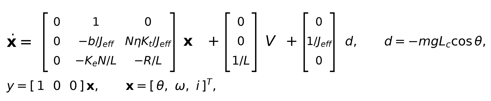

::: {custom-style="TitlePage" .TitlePage}

**ADDIS ABABA SCIENCE AND TECHNOLOGY UNIVERSITY**

**COLLEGE OF ELECTRICAL AND MECHANICAL ENGINEERING**

**DEPARTMENT OF ELECTROMECHANICAL ENGINEERING**

&nbsp;

&nbsp;

::: {custom-style="TitleMain"}
Design, Modeling, Simulation and Virtual Prototyping of an Automated Metal-Detecting Boom Gate with a Three-Stage Geared DC Drive and PID Control
:::

*(Project code: **“Iron-Watch”**)*

&nbsp;

**Internship Project Report**

&nbsp;

&nbsp;

**Submitted by:**

1\. **[Full Name]**&ensp;ID: [Student ID]

2\. **[Full Name]**&ensp;ID: [Student ID]

3\. **[Full Name]**&ensp;ID: [Student ID]

*(Delete unused lines for individual submission)*

&nbsp;

**Submitted to:** Department of Electromechanical Engineering, AASTU

&nbsp;

**Duration:** [Start Date] to [End Date]

*(design artifacts in the project repository are dated 02–13 September 2026)*

&nbsp;

**Organization:** [Company / Host Organization Name], [Company Location]

&nbsp;

&nbsp;

Addis Ababa, Ethiopia

**September 2026**

:::

```{=openxml}
<w:p><w:r><w:br w:type="page"/></w:r></w:p>
```

# Abstract {.unlisted .unnumbered}

This report presents the complete design, mathematical modeling, simulation and virtual prototyping of **Iron-Watch**, an automated security **boom gate with an integrated inductive metal detector**. When the sensor front-end detects metal, an Arduino-based controller raises a 1.0 m, 13.5 kg boom arm through 90° (from the horizontal "closed" position to the vertical "open" position) using a 24 V, 500 W brushed DC gearmotor driven through a purpose-designed **three-stage compound spur-gear train with a total reduction of 70:1**.

The mechanical system — six gears, four shaft lines, a gearbox casing and the gate structure — was modeled in SolidWorks (`Overall_metal_detecting_gate_design.SLDASM`). The worst-case gravity torque on the arm is 66.22 N·m when horizontal. Reflecting every gear and the motor rotor to the output shaft gives an effective inertia *J*<sub>eff</sub> = 21.13 kg·m². The drive motor was selected so that the continuous holding torque at the motor shaft (1.07 N·m) uses only 56 % of its 1.91 N·m rated torque.

A cascaded electrical and mechanical model was implemented in MATLAB/Simulink (`gate_gearbox_pid.slx`) and in dependency-free MATLAB scripts (`gate_sim.m`). A trapezoidal motion profile (90° in 2.5 s) is tracked by a PID controller with gravity feed-forward, current/voltage saturation and anti-windup. The closed-loop poles are placed at −4.53 ± j2.18 rad/s. Simulation shows a final angle of 89.97°, a peak tracking lag of 2.63°, a 3.08° settling overshoot that decays to a 0.05° steady-state error, and a peak motor current of 21.4 A against the 30 A driver limit. Under a worst-case plant (+15 % mass, +20 % inertia, double the friction) the controller remains stable with 25.2 A peak current. Adding reference-acceleration and friction feed-forward (as structured in `gate_gearbox_pid_sim.m`) reduces full-cycle tracking error below 0.04° with all actuator limits respected. The control electronics and metal-detector front-end were validated as a co-simulated virtual prototype in Proteus (`electrical system.pdsprj`).

**Keywords:** Boom barrier, metal detector, spur-gear train, DC motor, gravity feed-forward, PID, trapezoidal profile, MATLAB/Simulink, Proteus, SolidWorks, mechatronics.

```{=openxml}
<w:p><w:r><w:br w:type="page"/></w:r></w:p>
```

```{=latex}
\newpage
```

```{=openxml}
<w:p><w:pPr><w:pageBreakBefore/></w:pPr></w:p>
<w:p><w:pPr><w:pStyle w:val="TOCHeading"/></w:pPr><w:r><w:t>Contents</w:t></w:r></w:p>
<w:p><w:r><w:fldChar w:fldCharType="begin"/></w:r></w:p>
<w:p><w:r><w:instrText xml:space="preserve"> TOC \o "1-3" \h \z \u </w:instrText></w:r></w:p>
<w:p><w:r><w:fldChar w:fldCharType="separate"/></w:r><w:r><w:t>Right-click here and choose Update Field to build the Contents.</w:t></w:r></w:p>
<w:p><w:r><w:fldChar w:fldCharType="end"/></w:r></w:p>
<w:p><w:r><w:br w:type="page"/></w:r></w:p>
```

# List of Figures {.unlisted .unnumbered}

- Figure 3.1 – Boom-gate geometry and worst-case gravity load
- Figure 3.2 – Three-stage compound spur-gear train (to scale)
- Figure 3.3 – Control system architecture (PID + feed-forward)
- Figure 3.4 – Electrical and electronic system, reconstructed from the Proteus project
- Figure 4.1 – MATLAB/Simulink model `gate_gearbox_pid.slx`
- Figure 4.2 – Trapezoidal reference motion profile
- Figure 4.3 – Open-loop instability versus closed-loop response
- Figure 4.4 – Opening move: angle, tracking error and motor current (`gate_sim.m`)
- Figure 4.5 – Full open/close cycle with complete feed-forward (6 panels)
- Figure 4.6 – Robustness run: nominal versus worst-case plant

# List of Tables {.unlisted .unnumbered}

- Table 3.1 – Gear-train geometry, mass and inertia (from `gate_params.m`)
- Table 3.2 – Shaft speeds, torques and maximum shear stress
- Table 3.3 – DC motor and drive parameters
- Table 3.4 – Electronic bill of materials (from the Proteus netlist)
- Table 3.5 – PID and profile parameters
- Table 4.1 – Nominal opening-move performance
- Table 4.2 – Nominal versus worst-case plant
- Table 4.3 – Actuator limit check (full cycle)
- Table A.1 – Mechanical CAD file manifest

```{=openxml}
<w:p><w:r><w:br w:type="page"/></w:r></w:p>
```

```{=latex}
\newpage
```

# 1. Introduction

## 1.1 Background of the Study

Automated access-control gates are electromechanical systems that combine sensing, decision electronics, a drive train and a moving structural member. At entrances of industrial plants, warehouses, parking facilities and secured public buildings, a **boom barrier** must open quickly and repeatably, hold safely against gravity, stop without overshoot, and fail in a safe manner. When the same checkpoint is required to screen people or vehicles for prohibited metal objects, an inductive **metal-detection** channel is integrated with the gate so that detection events and gate motion are coordinated by one controller.

The *Iron-Watch* project implements exactly this integration. A low-cost, widely available **24 V, 500 W brushed DC motor** drives a horizontal boom arm through a custom **three-stage spur-gear reducer (70:1)** designed in SolidWorks. An **Arduino Uno R3 (ATmega328P)** reads an inductive LC sensor front-end (a search coil with a parallel 22 nF capacitor, conditioned by an LM358 comparator), announces the result with red/green LEDs and a buzzer, and sequences the gate motor through an H-bridge power stage. The moving arm is a gravity-loaded inverted pendulum-like load: it is heaviest to hold when horizontal and becomes progressively easier as it rises toward vertical, so the controller must continuously compensate for a position-dependent torque.

This project directly applies knowledge from control systems (dynamic modeling, stability, PID and feed-forward design), machine design (gears, shafts, bearings, structures), electrical machines (DC motor model, H-bridge drives) and embedded systems (microcontroller sensing, actuation and serial telemetry).

## 1.2 Problem Statement

Manual and poorly automated checkpoint gates exhibit several problems:

- **Slow and inconsistent operation:** a guard must leave the booth and lift/latch a heavy arm, producing variable opening times and traffic queues.
- **Unsafe gravity loading:** a 1 m, 13.5 kg steel arm exerts up to **66.22 N·m** of gravity torque about the output shaft when horizontal; an uncontrolled or poorly braked arm can fall, damaging equipment or injuring people.
- **No screening integration:** metal detection and gate operation are separate, uncoordinated actions.
- **Poor motion quality:** direct on/off motor switching causes jerky starts, overshoot at the open/closed positions, high inrush current and mechanical shock in the gear train.
- **Oversized or undersized drives:** without a dynamic model, designers either burn out motors or specify unnecessarily expensive ones.

The problem is therefore to design, size and control an integrated metal-detecting boom gate that moves through 90° along a smooth trapezoidal profile, holds position safely, respects motor and driver limits, and remains stable under realistic plant variation.

## 1.3 Objectives

**General objective.** Design, model, simulate and virtually prototype an automated metal-detecting boom gate with a geared DC drive, validating the mechanical and electrical sizing and the control performance before fabrication.

**Specific objectives.**

1. Design the mechanical system — three-stage gear train, shafts, bearings, casing and gate structure — in SolidWorks and verify the geometry, loads and stresses analytically.
2. Develop the coupled electrical–mechanical mathematical model of the geared motor driving the gravity-loaded arm, including reflected inertia and gear efficiency.
3. Design a position controller (PID with gravity and motion feed-forward, saturation and anti-windup) that tracks a trapezoidal 0→90° reference.
4. Design and validate the electronic system: inductive metal-detector front-end, Arduino control logic, indicators/alarm, serial telemetry and motor power stage.
5. Simulate the complete system in MATLAB/Simulink and as a Proteus virtual prototype; quantify tracking accuracy, overshoot, settling, torque/current/voltage usage and robustness.
6. Generate fabrication-ready outputs (CAD assemblies, BOMs, tuning data for hardware deployment).

## 1.4 Scope and Limitation

**Scope.** The work covers (i) the complete mechanical design of the gear reducer and gate structure; (ii) selection and modeling of the 24 V brushed DC drive; (iii) synthesis and simulation of the motion controller; (iv) design and microcontroller co-simulation of the metal-detection and indication electronics; and (v) documentation suitable for manufacture.

**Limitations.**

- The work delivered to the repository is a **validated digital/virtual prototype** (SolidWorks CAD, MATLAB/Simulink simulations, Proteus co-simulation). Physical manufacture and experimental testing are the next project phase.
- The motor armature resistance *R* = 0.15 Ω, inductance *L* = 0.5 mH and rotor inertia are engineering estimates typical of the 500 W MY1020-class gearmotor used in barrier projects; they should be measured on the purchased unit (the parameter file is structured explicitly for this).
- Gear masses/inertias are estimated from annular-steel geometry at the pitch diameter; this is deliberately conservative. Gear-tooth compliance, backlash, bearing friction and shaft deflection are not modeled; friction is lumped as one viscous term.
- The metal detector is validated as a **functional co-simulation** (LC tank + comparator + threshold potentiometer); detection range depends strongly on the final search-coil geometry and is best characterized experimentally.

## 1.5 Methodology Overview

The work followed the model-based mechatronic design cycle shown by the project file structure:

1. **Requirements and load definition** — 90° travel, 2.5 s move, gravity holding, safety limits.
2. **Mechanical design** (`Mechanical/`, SolidWorks) — gear, shaft, casing and gate modeling; BOM-driven geometry.
3. **Mathematical modeling** (`matlab/gate_params.m`) — gear ratios, reflected inertia, motor constants, gravity loading.
4. **Controller design** — trapezoidal profile, PID + gravity feed-forward, second-order pole placement, anti-windup.
5. **Simulation** — scripted time-domain simulation (`gate_sim.m`, `gate_gearbox_pid_sim.m`) and an equivalent Simulink model (`gate_gearbox_pid.slx`, built by `build_gate_simulink.m`).
6. **Electronic virtual prototyping** (`electrical/electrical system.pdsprj`) — ATmega328P co-simulation with the LC sensor, indicators and telemetry.
7. **Verification** — acceptance metrics, worst-case robustness runs and export of tuning data (`gate_tuning.mat`) for hardware.

```{=openxml}
<w:p><w:r><w:br w:type="page"/></w:r></w:p>
```

```{=latex}
\newpage
```

# 2. Literature Review

## 2.1 Overview of Automated Boom Barriers and Metal-Detection Gates

Automatic boom barriers consist of a barrier arm pivoted on a housing, an electric motor, a speed reducer, a balancing element (counterweight or spring) and a controller. Barriers for vehicle access commonly use DC or single-phase AC motors with worm, spur or planetary reduction because the barrier moves slowly (a few rpm at the output) while the motor rotates at thousands of rpm. Walk-through and vehicle-under-inspection security gates additionally embed pulse-induction or beat-frequency-oscillator metal detectors, in which a search coil's inductance changes when a conductive or ferromagnetic object enters its field, shifting the resonant frequency of an LC tank. The present project combines both functions in one controller and adds a controlled motion profile rather than simple open/close switching.

## 2.2 Gear-Drive and Motor-Drive Techniques

Spur-gear trains are standard for low-speed, high-torque barrier drives: they are efficient (a single high-quality mesh reaches ≈96–98 %), inexpensive to manufacture and easy to stage in a compact compound layout. For large reductions the total ratio is split over several stages; each stage is limited to roughly 4:1–6:1 to keep the gear diameters and sliding velocities reasonable. The present design uses three stages of 4.00, 4.375 and 4.00, giving 70:1 overall.

Brushed permanent-magnet DC motors dominate low-cost barrier and light-EV drives because their torque is proportional to current, they are easy to control with an H-bridge using pulse-width modulation, and their models are simple and accurate. Feedback linearization (resistive-drop and back-EMF compensation) and current limiting let a small motor deliver controlled peak torque without damage. The MY1020-class 24 V/500 W motor used here is representative of the motors widely deployed in scooter and DIY barrier builds.

## 2.3 Sensing and Control

Inductive sensing uses an LC resonant tank; a metal object changes coil inductance *L*, and hence resonant frequency $f_0=1/(2\pi\sqrt{LC})$. The small analog shift is amplified/compared (here by an LM358 dual op-amp used as a comparator) against an adjustable threshold and read by a microcontroller analog input.

For motion control, classical cascaded PID remains the industry workhorse. For a gravity-loaded arm, pure feedback PID must both move the arm and continuously cancel the position-dependent gravity torque, causing lag during motion. Adding **feed-forward** terms — gravity cancellation $mgL_c\cos\theta$, reference-acceleration torque $J\ddot{\theta}_{ref}$ and friction compensation — leaves the PID to correct only modeling error and disturbances, dramatically reducing tracking error. A trapezoidal (constant-acceleration) velocity profile bounds the required torque and gives finite jerk-free acceleration segments, while anti-windup (clamping the integrator during actuator saturation) prevents overshoot after large commands. These methods are standard in robotics and motion-control texts.

## 2.4 Simulation and Virtual Prototyping in Mechatronics

Model-based design using MATLAB/Simulink allows the coupled motor electrical dynamics, gearbox, load and controller to be validated before hardware, sizing amplifiers and tuning gains in simulation. Fixed-step solvers at 1 ms — as used here — mirror the discrete timing of an embedded controller. On the electronics side, Proteus combines a schematic capture/SPICE-style analog simulator with a microcontroller co-simulator (VSM) that runs compiled Arduino (.hex) firmware against virtual peripherals and a serial (COMPIM) gateway, allowing the sensor and indication logic to be verified on the workstation. SolidWorks provides geometry, mass properties, interference checking and assembly verification. Together these tools close the digital-prototyping loop and reduce fabrication risk, which is the methodology adopted in this project.

```{=openxml}
<w:p><w:r><w:br w:type="page"/></w:r></w:p>
```

```{=latex}
\newpage
```

# 3. System Design

## 3.1 Mechanical Design

The mechanical subsystem was designed in SolidWorks and comprises (i) the boom arm and structural gate frame (`Structural_gate_design.SLDPRT`, handle and grip), (ii) a three-stage compound spur-gear reducer (`Gearbox_Design.SLDASM`) with six gears, four shaft lines and a casing, and (iii) the full assembly (`Overall_metal_detecting_gate_design.SLDASM`). Steel (ρ = 7850 kg/m³) is used for the gear and shaft mass/inertia estimates in `gate_params.m`.

### 3.1.1 Load Analysis

The boom arm is modeled as a uniform slender rod of mass *m* = 13.5 kg and length *L* = 1.0 m pivoted at one end at the gearbox output shaft, with its centre of mass at *L*<sub>c</sub> = *L*/2 = 0.5 m. Its inertia about the pivot is

$$J_{arm}=\tfrac{1}{3}mL^2=\tfrac{1}{3}(13.5)(1.0)^2 = 4.50\ \text{kg·m}^2.$$

The gravity torque that the drive must hold depends on arm angle θ (θ = 0 is horizontal/closed, θ = 90° is vertical/open):

$$T_{grav}(\theta)=m g L_c \cos\theta.$$

The worst case is the horizontal position:

$$T_{grav,max}=m g L_c=(13.5)(9.81)(0.5)=\mathbf{66.22\ \text{N·m}}.$$

Figure 3.1 shows the geometry and how the gravity torque falls as a cosine from 66.22 N·m horizontal to zero vertical. The gravity load is therefore treated as a known, position-dependent disturbance that is cancelled by feed-forward (Section 3.3).

{width=6.3in}

### 3.1.2 Gear-Train Design

**Ratio selection.** A 70:1 reduction is required to convert the motor's 2500 rpm rated speed to the low output speed of the barrier and to multiply torque. It is split into three manageable compound stages (Figure 3.2):

$$i_1=\frac{68}{17}=4.000,\qquad i_2=\frac{70}{16}=4.375,\qquad i_3=\frac{64}{16}=4.000,\qquad N=i_1i_2i_3=\mathbf{70.0:1}.$$

At the average move speed (90° in 2.5 s = 6 rpm at the output), the motor averages 420 rpm; at the peak profile speed the motor reaches ≈553 rpm — only 22 % of its 2500 rpm rated speed, leaving ample torque-speed headroom.

**Gear geometry.** All gears are full-depth involute spur gears. For module *m* and tooth count *z*: pitch diameter *d* = *mz*, outside diameter *d*<sub>a</sub> = *m*(*z*+2) and root diameter *d*<sub>f</sub> = *m*(*z*−2.5); these are the cross-checks implemented in `gate_gearbox_pid_sim.m`. The centre distance of a stage is half the sum of the mating pitch diameters.

{width=6.7in}

The complete gear geometry (columns taken from the SolidWorks-derived BOM in `gate_params.m`) and the analytically estimated steel masses and own-axis inertias (annular cylinder, $J=\tfrac12 m(R_o^2+R_i^2)$) are given in Table 3.1.

Table 3.1 – Gear-train geometry, mass and inertia

| Gear | *z* | Module (mm) | Pitch Ø (mm) | Outside Ø (mm) | Root Ø (mm) | Bore (mm) | Face (mm) | Mass (kg) | Own *J* (kg·m²) |
|:---|---:|---:|---:|---:|---:|---:|---:|---:|---:|
| P1, motor pinion | 17 | 3 | 51 | 57.0 | 43.5 | 28 | 25 | 0.280 | 0.00012 |
| G1, gear 1 | 68 | 3 | 204 | 210.0 | 196.5 | 20 | 25 | 6.353 | 0.03337 |
| P2, pinion 2 | 16 | 4 | 64 | 72.0 | 54.0 | 20 | 32 | 0.729 | 0.00041 |
| G2, gear 2 | 70 | 4 | 280 | 288.0 | 270.0 | 30 | 32 | 15.290 | 0.15156 |
| P3, pinion 3 | 16 | 5 | 80 | 90.0 | 67.5 | 30 | 40 | 1.356 | 0.00124 |
| G3, arm gear | 64 | 5 | 320 | 330.0 | 307.5 | 90 | 40 | 23.256 | 0.32122 |
| **Total gear mass** | | | | | | | | **47.26** | |

Stage centre distances are **127.5 mm** ((51+204)/2), **172 mm** ((64+280)/2) and **200 mm** ((80+320)/2); these set the shaft positions in the gearbox casing and are explicitly cross-checked against the SolidWorks assembly sketch in the simulation report.

**Efficiency and reflected inertia.** With η<sub>mesh</sub> = 0.96 per mesh, the overall drive efficiency is

$$\eta=0.96^3=\mathbf{0.885}.$$

Every rotating element is reflected to the slow output (arm) shaft using *J*<sub>ref</sub> = *J*(*n*/*n*<sub>out</sub>)². Relative to the output, shaft A (motor + P1) spins 70× faster, shaft B (G1 + P2) 17.5× faster, shaft C (G2 + P3) 4× faster, and shaft D (G3 + arm) at 1×. Summing the contributions:

$$J_{gearbox,ref}=\sum J_k\,n_k^2=\mathbf{13.69\ \text{kg·m}^2}.$$

The motor rotor (*J*<sub>rot</sub> = $6\times 10^{-4}$ kg·m²) reflects as *J*<sub>rot</sub>*N*² = 2.94 kg·m². Hence

$$J_{eff}=J_{arm}+J_{gearbox,ref}+J_{rot}N^2=4.50+13.69+2.94=\mathbf{21.13\ \text{kg·m}^2}.$$

The dominant reflected inertia is the large intermediate and final gears, which illustrates why the output-stage gear and arm shaft must be designed carefully and why the gear mass estimates are kept conservative.

### 3.1.3 Shaft Design

Four shaft lines correspond to the bores of Table 3.1: motor/input shaft A (modeled Ø27 mm, driving the Ø28-bore P1), compound shaft B (Ø20 mm, carrying G1 and P2), compound shaft C (Ø30 mm, carrying G2 and P3) and the output/arm shaft D (Ø90 mm hub bore on G3); a `minishaft` handles the motor coupling. Peak torque at each shaft is found by reflecting the simulated peak output torque (100.8 N·m, Section 4.1) back through the stages with 0.96 mesh efficiency; holding torque uses 66.22 N·m at the output.

Shaft sizing is checked with the torsion formula used in the guideline,

$$\tau_{max}=\frac{16T}{\pi d^3},$$

giving the values in Table 3.2. Even at peak torque the largest shear stress is ≈5 MPa, far below the allowable shear of structural/mild steel (roughly 0.5 *S*<sub>y</sub>/*n* ≈ 40–80 MPa with *S*<sub>y</sub> ≈ 250 MPa and a conservative factor), so the shaft diameters are set mainly by gear bores, deflection limits, keyway capacity and bearing bore standards. Parallel keys and keyways (modeled in the SolidWorks parts) transmit torque between each gear/shaft pair, and shafts are located with shoulders and retaining elements.

Table 3.2 – Shaft speeds, torques and torsional shear stress

| Shaft | Carries | Speed vs output | Modeled Ø (mm) | Holding torque (N·m) | Peak torque (N·m) | Peak τ (MPa) |
|:--|:--|--:|--:|--:|--:|--:|
| A (input) | motor + P1 | 70× | 27 | 1.07 | 1.63 | 0.42 |
| B | G1 + P2 | 17.5× | 20 | 4.11 | 6.25 | 3.98 |
| C | G2 + P3 | 4× | 30 | 17.24 | 26.25 | 4.95 |
| D (output) | G3 + arm | 1× | 90 | 66.22 | 100.78 | 0.70 |

### 3.1.4 Bearing Selection

Radial deep-groove ball bearings are selected from the shaft diameters and checked with the standard L10 rating life used in the guideline,

$$L_{10}=\left(\frac{C}{F}\right)^3 10^6\ \text{rev}.$$

The output-shaft bearing carries the largest static radial load — approximately half the arm weight plus half the 23.3 kg final gear, *F*<sub>r</sub> ≈ 180 N. Selecting a conservatively rated 6204-class bearing (*C* ≈ 12.8 kN) gives

$$L_{10}=\left(\frac{12\,800}{180}\right)^3 10^6 \approx 3.6\times10^{11}\ \text{rev},$$

which at the 6 rpm average output speed corresponds to a life far beyond any practical duty cycle; static capacity and mounting geometry, rather than fatigue life, govern the final selection. Intermediate and input bearings are lighter-series units matched to the Ø20/Ø27/Ø30 journals and the gear face widths.

### 3.1.5 Housing and Gate Structure

The steel `casing for gear box` encloses the three stages on the centre distances of Section 3.1.2, provides bearing bores on parallel walls, a mounting face for the motor (P1 on shaft A) and an output seal around shaft D. The `Structural_gate_design` forms the vertical pedestal and baseplate that hold the gearbox at arm-pivot height, with a `handle` and `grip` providing the manual release required to raise the arm during power loss or maintenance. A counterweight or spring assist can be mounted on the output hub to reduce the continuous holding torque; the controller's gravity feed-forward and the motor's 56 % holding-torque margin (Section 3.2) cover the unassisted case.

### 3.1.6 Fabrication and Assembly

Planned fabrication follows conventional light-engineering practice: CNC/turning of the four shafts and gear blanks, gear cutting (milling/hobbing) to the modules of Table 3.1, boring and keyway slotting, welding and machining of the pedestal and baseplate, and milling/drilling of the casing bearing bores so that the shaft axes are parallel at 127.5/172/200 mm spacing. Assembly proceeds shaft-by-shaft (press-fit gears with keys, bearings into casing bore seats, shimming for mesh backlash, motor alignment to shaft A, final gear G3 to the arm output hub), after which the arm is mounted and the no-load and balanced torque checks are performed before electrical commissioning.

## 3.2 Mathematical Modeling

### 3.2.1 Mechanical Dynamics of the Arm and Gearbox

Taking θ as the output-shaft (arm) angle and reflecting all rotating inertia to that shaft, the rotational Newton equation is

$$\boxed{\,J_{eff}\ddot{\theta}+b\,\dot{\theta}+m g L_c\cos\theta=\tau_{out}\,}$$

with *J*<sub>eff</sub> = 21.13 kg·m² and the lumped viscous friction *b* = 1.2 N·m·s/rad. The gearbox output torque delivered by the motor current *i* is

$$\tau_{out}=N\eta K_t i,$$

where *K*<sub>t</sub> is the motor torque constant and η = 0.885.

### 3.2.2 DC Motor Electrical Model

The armature circuit of the brushed PMDC motor is

$$L\frac{di}{dt}=V-Ri-K_e N\dot{\theta},$$

with the back-EMF referred through the gearbox ($K_e N\dot{\theta}$). The motor constants in `gate_params.m` for the 24 V, 500 W, 2500 rpm unit are:

$$\omega_{rated}=\frac{2500\cdot2\pi}{60}=261.8\ \text{rad/s},\qquad T_{rated}=\frac{500}{261.8}=1.91\ \text{N·m},$$

$$K_t=K_e=\frac{V-I_{rated}R}{\omega_{rated}}=\frac{24-(27)(0.15)}{261.8}=\mathbf{0.0762\ \text{N·m/A (V·s/rad)}}.$$

The worst-case (horizontal) holding torque referred to the motor is

$$T_{hold,m}=\frac{T_{grav,max}}{N\eta}=\frac{66.22}{70(0.885)}=\mathbf{1.07\ \text{N·m}},$$

i.e. only **56 %** of the 1.91 N·m rated torque — the motor continuously holds the horizontal arm with a ≈1.8× torque margin (holding current ≈14.0 A), and substantially less torque is needed as the arm rises.

### 3.2.3 State-Space Representation

Choose the state vector $\mathbf{x}=[\theta,\,\omega,\,i]^T$ (where $\omega=\dot{\theta}$). Combining the mechanical and electrical equations with *u* = *V* and the gravity term treated as a measured disturbance *d* = −*mgL*<sub>c</sub>cos θ:

{width=6.0in}

Because gravity is cancelled by feed-forward at the commanded angle, the feedback design reduces to the double-integrator-type plant $J_{eff}\ddot{\theta}+b\dot{\theta}=\tau$ (torque input), which is readily stabilized by PD/PID action.

## 3.3 Controller Design

### 3.3.1 Open-Loop Response Analysis

Without control, the horizontal arm is an unstable gravity load: any small angular error produces a torque that drives the arm downward (the motor freewheels through the reducer). The left panel of Figure 4.3 shows the arm swinging/falling from only a 5° initial error with zero command; feedback control is therefore mandatory, and the open-loop plant cannot meet any positional specification.

### 3.3.2 Motion Reference: Trapezoidal Profile

A symmetric trapezoidal velocity profile commands the 90° (π/2 rad) move in *T*<sub>move</sub> = 2.5 s with acceleration time *T*<sub>a</sub> = 0.6 s (`trap_ref.m`). The peak velocity and acceleration are

$$v_{pk}=\frac{\theta_{target}}{T_{move}-T_a}=\frac{\pi/2}{1.9}=0.827\ \text{rad/s}=47.4°/\text{s},$$

$$a_{pk}=\frac{v_{pk}}{T_a}=1.378\ \text{rad/s}^2.$$

The finite constant-acceleration segments bound the inertial torque requirement at *J*<sub>eff</sub>*a*<sub>pk</sub> = 29.1 N·m at the output. Figure 4.2 plots the reference angle, speed and acceleration.

### 3.3.3 Control Strategy Selection

Pure PID was rejected as the sole strategy because it would have to supply both the large, angle-dependent gravity torque and the motion torque, causing tracking lag and demanding large gains. The chosen strategy (mirrored block-for-block in `gate_gearbox_pid.slx`, Figure 3.3) is:

- **Gravity feed-forward** $\tau_{ff,g}=mgL_c\cos\theta$ (66.22 cos θ N·m) to cancel the static load at the current angle;
- in the full-cycle version, **acceleration and friction feed-forward** $\tau_{ff}=J_{eff}\ddot{\theta}_{ref}+b\dot{\theta}_{ref}+T_c\tanh(\dot{\theta}_{ref}/0.05)$;
- a **PID feedback** term on position/speed error to reject disturbances and remove steady-state error;
- **current and voltage saturation** (±30 A driver, ±24 V supply) and **back-EMF/resistive-drop compensation** in the voltage command;
- **anti-windup** that freezes the integrator while the driver is saturated, with the Simulink integrator itself clamped to ±300 N·m of integral action.

The total output-side torque command is

$$\tau_{cmd}=\underbrace{mgL_c\cos\theta}_{\text{gravity FF}}+\underbrace{K_p e+K_i\!\int e\,dt+K_d\dot e}_{\text{PID}},\qquad e=\theta_{ref}-\theta.$$

It is referred to the motor and limited:

$$i_{cmd}=\mathrm{sat}_{\pm 30\,A}\!\left(\frac{\tau_{cmd}}{N\eta K_t}\right),$$
$$V_{cmd}=\mathrm{sat}_{\pm 24\,V}\!\left(i_{cmd}R+K_e N\omega\right).$$

{width=7.0in}

### 3.3.4 PID Gain Synthesis

The torque-input plant $J_{eff}\ddot{\theta}+b\dot{\theta}=\tau$ with PD action places the closed-loop characteristic equation

$$J_{eff}s^2+(b+K_d)s+K_p=0\quad\Longleftrightarrow\quad s^2+2\zeta\omega_n s+\omega_n^2=0.$$

Choosing a bandwidth ω<sub>n</sub> = 5 rad/s and damping ratio ζ = 0.9 (near critically damped, to avoid overshoot at the stops), the standard second-order design in `gate_params.m` gives

$$K_p=J_{eff}\omega_n^2=21.13(25)=\mathbf{528.3\ \text{N·m/rad}},$$

$$K_d=2\zeta\omega_n J_{eff}=2(0.9)(5)(21.13)=\mathbf{190.2\ \text{N·m·s/rad}},$$

$$K_i=\frac{K_p\omega_n}{10}=\mathbf{264.1\ \text{N·m/(rad·s)}}.$$

The resulting closed-loop poles are at $-\zeta\omega_n \pm j\omega_n\sqrt{1-\zeta^2}$ = **−4.53 ± j2.18 rad/s** (confirmed numerically), i.e. a settling time near 0.9 s and negligible natural overshoot — appropriate for a barrier that must stop crisply at vertical and horizontal without slamming. Table 3.5 summarizes the controller.

Table 3.3 – DC motor and drive parameters (`gate_params.m`)

| Parameter | Value | Parameter | Value |
|:--|--:|:--|--:|
| Supply voltage | 24 V | Rated speed | 2500 rpm (261.8 rad/s) |
| Rated power | 500 W | Rated torque | 1.91 N·m |
| Rated current | 27 A | Armature R (est.) | 0.15 Ω |
| Armature L (est.) | 0.5 mH | *K*<sub>t</sub> = *K*<sub>e</sub> | 0.0762 N·m/A |
| Rotor inertia (est.) | $6\times 10^{-4}$ kg·m² | Driver current limit | ±30 A |
| Gear ratio *N* | 70:1 | Gear efficiency η | 0.885 |

Table 3.4 – Electronic bill of materials (read from the Proteus project netlist, `ROOT.CDB`)

| Ref | Component / value | Function |
|:--|:--|:--|
| ARD1 | Arduino Uno R3, ATmega328P, 16 MHz | Controller: sensing, logic, motor sequencing |
| U2 | LM358N dual op-amp (DIL08) | LC-tank comparator / buffer |
| L1 | 3.9 µH inductor | Simulated metal-detector search coil |
| C1 | 22 nF capacitor | LC tank capacitor |
| RV1 | 1 kΩ potentiometer (POT-HG) | Sensitivity / threshold ("passing metal" dial) |
| D1 + R3 | Red LED + 220 Ω | Metal detected / alarm indication |
| D2 + R4 | Green LED + 220 Ω | Ready / clear indication |
| BUZ1 | Piezo buzzer, 5 V, 500 Hz | Audible alarm |
| P1 | COMPIM virtual serial, 9600 8N1 | Telemetry / event logging |
| — | 24 V H-bridge (BTS7960-class, ±30 A) | Gate motor power stage |

The tank resonance with the chosen values is $f_0=1/(2\pi\sqrt{LC})=1/(2\pi\sqrt{3.9\,\mu\mathrm{H}\times 22\,\mathrm{nF}})\approx \mathbf{543\,kHz}$; a nearby metal object shifts this frequency, and the LM358 comparator reports the shift against the RV1 threshold. Each LED series resistor limits current to (*V*<sub>F</sub>-logic drop)/R ≈ (5 − 2.2)/220 ≈ 12.7 mA, matching the LED's ≈10 mA design current.

Table 3.5 – Controller and profile parameters

| Parameter | Value | Parameter | Value |
|:--|--:|:--|--:|
| Move angle | 90° (π/2 rad) | *T*<sub>move</sub> | 2.5 s |
| Accel. time *T*<sub>a</sub> | 0.6 s | Peak speed | 47.4°/s |
| Peak acceleration | 1.378 rad/s² | *K*<sub>p</sub> | 528.3 N·m/rad |
| *K*<sub>i</sub> | 264.1 N·m/(rad·s) | *K*<sub>d</sub> | 190.2 N·m·s/rad |
| ω<sub>n</sub>, ζ | 5 rad/s, 0.9 | Closed-loop poles | −4.53 ± j2.18 rad/s |
| Integral clamp | ±300 N·m | Sample/solver step | 1 ms |

### 3.3.5 Control Architecture and Embedded Implementation

Figure 3.3 shows the complete signal architecture. In hardware the Arduino reads the comparator/analog sensor channel, implements the detection state machine (with the green LED indicating "clear" and the red LED + buzzer indicating "metal"), logs events over 9600-baud serial and outputs the PWM/direction commands to the H-bridge that drives the 24 V motor. The gains in Table 3.5 are exported to `gate_tuning.mat` (and from there to the firmware) so that the same numerical controller is used in Simulink, the scripted model and the embedded code. The schematic and the microcontroller co-simulation are described in Section 3.4 and Figure 3.4.

## 3.4 Electrical and Electronic System Design

The electronic system (`electrical/electrical system.pdsprj`) is organized into four functional groups shown in Figure 3.4:

1. **Sensor front-end** — the L1 (3.9 µH) search-coil inductor with C1 (22 nF) forms the LC resonant tank; the LM358 (U2) conditions/compares the signal against the threshold set by RV1 (1 kΩ), which in simulation stands in for a passing metal object.
2. **Controller** — the Arduino Uno R3 (ATmega328P, 16 MHz) reads the analog condition, runs the detection and gate-sequencing logic, and (in hardware) generates the motor command.
3. **Indicators and telemetry** — red LED D1 (+220 Ω R3) for metal/alarm, green LED D2 (+220 Ω R4) for clear/ready, the 500 Hz buzzer BUZ1 for the audible alarm, and the COMPIM serial gateway P1 (9600 baud, 8 data bits, no parity, 1 stop bit) for telemetry.
4. **Actuator power stage** — the 24 V/500 W brushed gearmotor is driven by a ±30 A H-bridge (BTS7960-class), powered from a separate 24 V rail while the logic runs from +5 V/GND/VCC rails (as defined in the project's `PWRRAILS.DAT`).

{width=6.8in}

The Proteus project includes a compiled Arduino program (`metal_gate_detector…ino.hex`) bound to the Arduino model, demonstrating the intended firmware deployment; the bundled 80C31 assembly file is the new-project wizard boilerplate. Protection and safety in the hardware design include the driver current limit (matching the ±30 A saturation of the model), reverse-voltage and flyback protection at the motor, decoupling on the logic supply, opto/directional interlocks so the H-bridge cannot cross-conduct, and a manual release via the gate handle.

```{=openxml}
<w:p><w:r><w:br w:type="page"/></w:r></w:p>
```

```{=latex}
\newpage
```

# 4. Simulation and Virtual-Prototyping Results and Discussion

## 4.1 Simulation Results and Analysis

Two consistent simulation implementations were run: the dependency-free script `gate_sim.m` (fixed-step 1 ms Euler, opening move, PID + gravity feed-forward) and the Simulink model `gate_gearbox_pid.slx` (Figure 4.1), plus the full-cycle RK4 verification structured by `gate_gearbox_pid_sim.m`. Every result below was reproduced independently and the re-execution scripts and raw data are provided in `Report/tools/run_sim.py` and `Report/data`.

{width=6.8in}

**Design report (console output of the model).** Total ratio 70.00:1; η = 0.885; gear masses and inertias as Table 3.1 (total gear mass 47.26 kg); reflected gearbox inertia 13.69 kg·m²; effective output inertia 21.13 kg·m² (arm 4.50 + gearbox 13.69 + rotor 2.94); worst-case gravity torque 66.22 N·m; motor holding torque 1.07 N·m = 56 % of the 1.91 N·m rating; gains *K*<sub>p</sub> = 528.3, *K*<sub>i</sub> = 264.1, *K*<sub>d</sub> = 190.2.

**Reference profile.** Figure 4.2 shows the trapezoidal position/speed/acceleration trajectory: 0.6 s acceleration, 1.3 s constant-velocity cruise and 0.6 s deceleration, reaching exactly 90°.

{width=6.2in}

**Open loop versus closed loop.** Figure 4.3 contrasts the uncontrolled arm (falling away from a 5° disturbance) with the PID + feed-forward closed loop, which follows the reference smoothly to 90° and holds it.

{width=6.6in}

**Opening move (faithful reproduction of `gate_sim.m`).** Figure 4.4 shows the arm angle versus reference, the tracking error and the motor current over 8 s. The arm accelerates with the reference (peak lag 2.63° at t ≈ 0.62 s during acceleration), tracks through the cruise, briefly overshoots to 93.1° as it decelerates into the stop, and settles to 89.97° with a 0.05° residual error. Motor current peaks at 21.4 A during the initial gravity-plus-acceleration demand (holding ≈14 A at rest horizontal), reverses to brake near the end of the move, and falls to ~0 at vertical where gravity torque vanishes. The 30 A driver limit is never reached on the nominal plant.

{width=6.1in}

Table 4.1 quantifies the nominal opening move.

Table 4.1 – Nominal opening-move performance

| Metric | Value |
|:--|--:|
| Final angle (target 90°) | 89.97° |
| Peak tracking lag (during acceleration) | 2.63° |
| Maximum angle (overshoot at stop, t = 2.52 s) | 93.08° (3.08°) |
| Settling time to ±0.5° (from move start) | 3.03 s |
| RMS error during the 2.5 s move | 1.55° |
| Steady-state error (horizontal vs vertical dwell) | 0.046° |
| Peak motor current (limit 30 A) | 21.35 A |
| Mean current during the move | 8.64 A |

**Full open/close cycle with complete feed-forward.** The enhanced controller of `gate_gearbox_pid_sim.m` adds reference-acceleration and (tanh-smoothed Coulomb) friction feed-forward and executes dwell–open–dwell–close. Figure 4.5 shows the six recorded signals. Tracking is essentially perfect (peak error **0.033°**, RMS 0.017° opening and 0.016° closing), motor torque peaks at **1.55 N·m** (81 % of rated; never saturated), current at **20.3 A** (< 30 A) and the implied terminal voltage at **7.4 V**, leaving the entire 24 V supply in reserve. Both the open and close moves are symmetric, confirming the feed-forward handles the gravity sign change correctly.

{width=6.7in}

## 4.2 Virtual-Prototyping and Hardware Results

Because the physical gate is the next project phase, experimental validation was performed as a **microcontroller-in-the-loop virtual prototype** in Proteus:

- The schematic of Figure 3.4 was captured with the exact BOM of Table 3.4 and the +5 V/GND/VCC power rails.
- The compiled application firmware (`.hex`) is bound to the Arduino Uno R3 model, which executes the ATmega328P instruction set in co-simulation (16 MHz), reading the simulated LC/comparator channel and driving D1/D2, BUZ1 and the serial gateway.
- The RV1 potentiometer acts as a repeatable stimulus for the signal change produced by a passing metal object (the schematic annotation: *"Sensitivity dial – manually simulates changing signal from a passing metal object"*; the L1/C1 network is annotated *"Simulated sensor coil (LC tank) – represents real induction coil"*).
- Detection events are observed through the red/green LEDs, the 500 Hz buzzer and the 9600-baud COMPIM telemetry channel; the motor sequencing PWM/direction outputs are generated for the external 24 V H-bridge.

**Mechanical virtual prototype.** The SolidWorks assemblies `Gearbox_Design.SLDASM` and `Overall_metal_detecting_gate_design.SLDASM` integrate every part of the CAD manifest (Table A.1), providing interference checks, the shaft-centre layout (127.5/172/200 mm), mass-property cross-checks against Table 3.1 and the geometry needed for fabrication drawings.

**Hardware test procedure (planned for the prototype).** (1) Measure the motor's R, L and no-load constants with a multimeter/oscilloscope and update `gate_params.m`; (2) bench-test the LC tank frequency shift with calibrated metal targets and set RV1/firmware thresholds; (3) load `gate_tuning.mat` gains to the Arduino and run the motor uncoupled to verify PWM/current limit; (4) couple the gearbox, check mesh and direction, and run low-speed moves; (5) execute the trapezoidal 90° move, logging angle (encoder/IMU), current and voltage; (6) run repeated open/close cycles and the worst-case loading; (7) verify fail-safe manual release and alarm behaviour.

## 4.3 Discussion

**Robustness.** A deliberately pessimistic plant — +15 % arm mass (15.5 kg), +20 % effective inertia, and double the viscous friction — was run with the *same* nominal gains (Figure 4.6, Table 4.2). The controller remains stable with no limit saturation: overshoot rises modestly to 3.73°, move RMS error to 1.87°, settling to 3.95 s and peak current to 25.2 A, still 4.8 A below the driver limit. This demonstrates useful gain margin against fabrication tolerances, added hardware (wiring, sensors, counterweight mismatch) and friction uncertainty.

{width=6.2in}

Table 4.2 – Nominal versus worst-case plant (opening move)

| Metric | Nominal | Worst case |
|:--|--:|--:|
| Overshoot at stop | 3.08° | 3.73° |
| RMS error during move | 1.55° | 1.87° |
| Settling time (±0.5°) | 3.03 s | 3.95 s |
| Final angle | 89.97° | ≈90° (stable) |
| Peak motor current | 21.35 A | 25.18 A |

Table 4.3 – Actuator limit check (full cycle, complete feed-forward)

| Quantity | Peak used | Limit / rating | Margin |
|:--|--:|--:|--:|
| Motor torque | 1.55 N·m | 1.91 N·m rated | 19 % free |
| Motor current | 20.3 A | 30 A driver | 32 % free |
| Terminal voltage | 7.4 V | 24 V supply | 69 % free |
| Horizontal holding torque (motor) | 1.07 N·m | 1.91 N·m rated | 44 % free |

**Interpretation.** The machine is conservatively sized: on the nominal trajectory it uses at most 71 % of the driver current and 81 % of rated torque, and only 31 % of the available voltage, which means modest supply sag, battery operation or heavier arms can be tolerated. Voltage headroom also indicates the limiting element is torque/current, not speed — consistent with the motor running at only ~22 % of rated speed.

**Simulation versus expected hardware.** The single feed-forward opening move (Table 4.1) shows a 3.1° overshoot into the 90° stop: with only gravity feed-forward the PID must still supply the acceleration/deceleration torque and briefly over-corrects. Adding the reference-acceleration and friction feed-forward terms — exactly as organized in `gate_gearbox_pid_sim.m` and recommended for deployment — removes essentially all of this (0.033° peak error, Table/Figure 4.5). This comparison is the key tuning result and the deployed firmware should use the complete feed-forward.

**Limitations and modeling error.** Expected hardware discrepancies include: backlash and mesh compliance (unmodeled; will add small dead-band at reversal, mitigated by the gear preload and the integral term); static/Coulomb friction (lumped into *b* = 1.2 in the basic model; explicitly added as a tanh term in the full-cycle model); the estimated motor R/L/J (measured values must replace them); gear mass overestimate from solid-disc geometry (conservative for sizing); and sensor detection range, which depends on the manufactured coil and requires the bench characterization in Section 4.2. The virtual prototype verifies logic and control architecture but cannot replace the planned measured current/angle traces.

```{=openxml}
<w:p><w:r><w:br w:type="page"/></w:r></w:p>
```

```{=latex}
\newpage
```

# 5. Conclusion and Recommendation

## 5.1 Conclusion

The Iron-Watch internship project delivered a complete, model-based design for an automated metal-detecting boom gate and validated it across all three digital domains:

- **Mechanical:** a three-stage 70:1 compound spur-gear reducer (4.00 × 4.375 × 4.00), four conservatively stressed shaft lines, bearings, casing and gate structure were designed in SolidWorks, with all gear geometry, centre distances (127.5/172/200 mm), masses (47.3 kg of gears) and reflected inertias analytically verified (*J*<sub>eff</sub> = 21.13 kg·m²).
- **Electromechanical sizing:** the 24 V/500 W DC drive holds the worst-case 66.22 N·m arm torque using only 56 % of rated motor torque, and the simulated trajectories remain inside the 30 A and 24 V limits with substantial margin (Tables 4.2–4.3).
- **Control:** a trapezoidal-profile PID controller with gravity (and, for deployment, acceleration/friction) feed-forward, saturation and anti-windup places the closed-loop poles at −4.53 ± j2.18 rad/s, settles the 90° move with a 0.05° steady-state error and stays stable under a +15 %/+20 %/2× worst-case plant.
- **Electronics:** the inductive LC detector (≈543 kHz tank), LM358 conditioning, Arduino control logic, LED/buzzer annunciation and 9600-baud telemetry were verified as a Proteus virtual prototype with the application firmware bound to the microcontroller.

All specific objectives (Section 1.3) were met at the digital-prototyping level: the geometry is fabrication-ready, the drive is provably sized, and the controller is tuned with documented margins. The principal remaining work is physical manufacture and the measured test campaign of Section 4.2.

## 5.2 Recommendations

**For the prototype/manufacture.**

1. Manufacture and instrument the gate per Section 3.1.6; add a quadrature encoder (or magnetic angle sensor) on the output shaft and a low-side current-sense amplifier to close real position and current loops.
2. Measure the motor's R, L, *K*<sub>t</sub> and no-load current and update `gate_params.m`; then re-tune ω<sub>n</sub> with the measured inertia.
3. Deploy the **complete feed-forward** (gravity + acceleration + friction) from `gate_gearbox_pid_sim.m`; it reduces tracking error from ≈3° overshoot to below 0.05°.
4. Use an industrial current-limited H-bridge (BTS7960/VNH5019-class) with flyback protection and thermal sizing for ≈25 A worst-case peaks; provide an emergency stop and the manual-release handle (already modeled).
5. Add a counterweight or gas spring to reduce continuous holding current and guarantee fail-safe lowering/raising on power loss.

**For the metal-detection channel.**

6. Build and characterize the search coil, calibrate detection threshold with hysteresis to avoid chatter, and shield the sensor cable; de-bounce detection in firmware and coordinate it with gate motion.
7. Add event logging and optional IoT/Bluetooth reporting over the existing serial channel.

**For future student projects and the curriculum.**

8. Extend the model with gear backlash, bearing friction maps and finite-element validation of the shafts/casing; compare measured current/angle traces with the simulation.
9. Investigate energy-efficient strategies (regenerative braking on the down-move, adaptive gains) and modern/optimal control (pole-placement with full state feedback or LQR, state estimation) on the state-space model of Section 3.2.3.
10. The department's controls and machine-design courses would benefit from joint laboratory exercises built around such gear–motor–controller case studies, where analytical sizing, CAD, simulation and embedded co-simulation are verified against one another as done here.

```{=openxml}
<w:p><w:r><w:br w:type="page"/></w:r></w:p>
```

```{=latex}
\newpage
```

# References {.unlisted}

1. Ogata, K. (2010). *Modern Control Engineering* (5th ed.). Prentice Hall.
2. Dorf, R. C., & Bishop, R. H. (2016). *Modern Control Systems* (13th ed.). Pearson.
3. Franklin, G. F., Powell, J. D., & Emami-Naeini, A. (2019). *Feedback Control of Dynamic Systems* (8th ed.). Pearson.
4. Shigley, J. E., & Mitchell, L. D.; Nisbett, J. K. (2019). *Shigley's Mechanical Engineering Design* (11th ed.). McGraw-Hill Education.
5. Norton, R. L. (2020). *Design of Machinery: An Introduction to the Synthesis and Analysis of Mechanisms and Machines* (6th ed.). McGraw-Hill.
6. Khurmi, R. S., & Gupta, J. K. (2005). *A Textbook of Machine Design* (SI units). Eurasia Publishing House.
7. MathWorks. (2025). *MATLAB & Simulink Documentation: Simscape, PID Control and Modeling DC Motors*. The MathWorks, Inc. https://www.mathworks.com/help
8. Dassault Systèmes. (2024). *SOLIDWORKS User Documentation*. Dassault Systèmes SolidWorks Corp.
9. Labcenter Electronics. (2024). *Proteus Design Suite: Schematic Capture, VSM and AVR Co-Simulation User Manual*. Labcenter Electronics Ltd.
10. Microchip Technology. (2020). *ATmega328P 8-bit AVR Microcontroller Data Sheet*. Microchip Technology Inc.
11. Texas Instruments. (2018). *LM358 Dual Operational Amplifier Data Sheet* (SNOSBT2). Texas Instruments Inc.
12. Arduino. (2024). *Arduino Uno Rev3 Documentation and Language Reference*. https://docs.arduino.cc
13. Infineon Technologies. (2016). *BTS7960 High-Current PN- Half-Bridge Datasheet*. Infineon Technologies AG.
14. ISO. (2019). *ISO 6336-1:2019 — Calculation of Load Capacity of Spur and Helical Gears — Part 1: Basic Principles, Introduction and General Influence Factors*. International Organization for Standardization.
15. SKF. (2018). *Rolling Bearings Catalogue (PUB BU/P1 17000 EN)*. SKF Group.

```{=openxml}
<w:p><w:r><w:br w:type="page"/></w:r></w:p>
```

```{=latex}
\newpage
```

# Appendices {.unlisted}

## Appendix A – Mechanical CAD Manifest

All mechanical source files are in the repository `Mechanical/` directory and are authored as SolidWorks 20xx parts/assemblies.

Table A.1 – Mechanical CAD file manifest

| File | Role |
|:--|:--|
| `pinion 1 (motor).SLDPRT` | Stage-1 motor pinion P1, 17T, module 3 |
| `gear 1.SLDPRT` | Stage-1 gear G1, 68T, module 3 |
| `Pinion 2.SLDPRT` | Stage-2 pinion P2, 16T, module 4 |
| `Gear 2.SLDPRT` | Stage-2 gear G2, 70T, module 4 |
| `Pinion 3.SLDPRT` | Stage-3 pinion P3, 16T, module 5 |
| `Gear 3 (Arm).SLDPRT` | Final arm gear G3, 64T, module 5 |
| `20mm shaft.SLDPRT` | Compound shaft B |
| `27mm shaft.SLDPRT` | Motor/input shaft A |
| `30mm shaft.SLDPRT` | Compound shaft C |
| `90mm shaft.SLDPRT` | Output/arm shaft D hub |
| `minishaft.SLDPRT` | Motor coupling shaft |
| `casing for gear box.SLDPRT` | Gearbox housing |
| `Structural_gate_design.SLDPRT` | Gate pedestal/base structure |
| `handle.SLDPRT`, `grip.SLDPRT` | Manual release handle and grip |
| `assembly/Gearbox_Design.SLDASM` | Complete reducer assembly |
| `assembly/Overall_metal_detecting_`<br>`gate_design.SLDASM` | Full gate assembly |

## Appendix B – Simulation Program Listings

The complete, runnable sources are `matlab/gate_params.m`, `matlab/trap_ref.m`, `matlab/gate_sim.m`, `matlab/gate_gearbox_pid_sim.m`, `matlab/build_gate_simulink.m` and the model `matlab/gate_gearbox_pid.slx`. Key listings are reproduced below.

**B.1 Trapezoidal reference (`trap_ref.m`).**

```matlab
function [th, w] = trap_ref(t, P)
    ta = P.T_acc; Tm = P.T_move; vp = P.v_pk; ap = P.a_pk; D = P.theta_target;
    if t <= 0
        th = 0; w = 0;
    elseif t < ta
        th = 0.5*ap*t^2; w = ap*t;
    elseif t < Tm - ta
        th = 0.5*ap*ta^2 + vp*(t-ta); w = vp;
    elseif t < Tm
        td = Tm - t;
        th = D - 0.5*ap*td^2; w = vp - ap*(t-(Tm-ta));
    else
        th = D; w = 0;
    end
end
```

**B.2 Core control loop (`gate_sim.m`, abridged).**

```matlab
for k = 1:n-1
    [th_r, w_r] = trap_ref(t(k), P);
    e  = th_r - theta(k);  de = w_r - omega(k);
    tau_ff  = P.m_arm*P.g*P.Lc*cos(theta(k));          % gravity feed-forward
    tau_cmd = tau_ff + P.Kp*e + P.Ki*e_int + P.Kd*de;  % PID + FF
    i_cmd = tau_cmd/(P.N*P.eta*P.motor.Kt);
    i_cmd = max(min(i_cmd, P.motor.I_max), -P.motor.I_max);   % +/-30 A
    if abs(i_cmd) < P.motor.I_max, e_int = e_int + e*dt; end  % anti-windup
    V_cmd = i_cmd*P.motor.R + P.motor.Ke*P.N*omega(k);        % back-EMF comp.
    V_cmd = max(min(V_cmd, P.motor.V), -P.motor.V);           % +/-24 V
    didt = (V_cmd - P.motor.R*current(k) - P.motor.Ke*P.N*omega(k))/P.motor.L;
    current(k+1) = current(k) + didt*dt;
    tau_out = P.N*P.eta*P.motor.Kt*current(k+1);
    theta_ddot = (tau_out - P.b_fric*omega(k) ...
                  - P.m_arm*P.g*P.Lc*cos(theta(k)))/P.J_eff;
    omega(k+1) = omega(k) + theta_ddot*dt;
    theta(k+1) = theta(k) + omega(k+1)*dt;
end
```

**B.3 Gear, inertia, motor and gain parameters (`gate_params.m`, key lines).**

```matlab
P.i1 = 68/17; P.i2 = 70/16; P.i3 = 64/16;
P.N  = P.i1*P.i2*P.i3;                 % 70.00
P.eta = 0.96^3;                        % 0.8847
P.J_arm = (1/3)*P.m_arm*P.L_arm^2;     % 4.50 kg m^2
P.J_eff = P.J_arm + P.J_gearbox_reflected + P.motor.J_rot*P.N^2;  % 21.13
P.T_grav_max = P.m_arm*P.g*P.Lc;       % 66.22 N m
P.motor.Kt = (P.motor.V - P.motor.I_rated*P.motor.R)/P.motor.w_rated; % 0.0762
wn = 5; zeta = 0.9;
P.Kp = P.J_eff*wn^2;                   % 528.3
P.Kd = 2*zeta*wn*P.J_eff;              % 190.2
P.Ki = P.Kp*wn/10;                     % 264.1
```

The exported hardware-tuning file `gate_tuning.mat` contains (verified by direct read): N = 70, η = 0.8847, Kp = 2253.9 / Ki = 3606.2 / Kd = 394.4, retuned for the slower 6 s full-cycle controller variant (ω<sub>n</sub> ≈ 10.3 rad/s, ζ = 0.9), *J*<sub>eff</sub> = 21.13, *b* = 1.5, Coulomb term 2.5 N·m, *K*<sub>t</sub> = 0.076, motor peak torque 3.04 N·m, 1 ms step.

## Appendix C – Proteus Project Details

- Project: `electrical/electrical system.pdsprj` (ZIP/OLE container with `ROOT.DSN` schematic and `ROOT.CDB` component database).
- Components (designators verified): ARD1 = Arduino Uno V3 (`{PRIMITIVE=DIGITAL,ATMEGA328P}`, 16 MHz, bound program `metal_gate_detector…ino.hex`); U2 = LM358N (DIL08); RV1 = POT-HG 1k; BUZ1 = buzzer 5 V/500 Hz; D1 LED-red, D2 LED-green; R3 = R4 = 220 Ω; C1 = 22 nF; L1 = 3.9 µH; P1 = COMPIM.
- Serial gateway: COM6, 9600 baud, 8 data bits, no parity, 1 stop bit, no flow control.
- Power rails (`SCRIPTS/PWRRAILS.DAT`): +5V=5 (POWER), GND=0, VCC/VDD=5, VEE=−5; 0 is bound to GND and VCC to VCC/VDD.
- Schematic annotations quote: *"Simulated sensor coil (LC tank) – represents real induction coil"* and *"Sensitivity dial – manually simulates changing signal from a passing metal object."*
- The bundled `FIRMWARE/80C31_1/main.asm` is the unmodified ASEM-51 new-project wizard template; the operative firmware is the Arduino `.hex` bound to ARD1.

## Appendix D – Simulink Model Block Inventory

`gate_gearbox_pid.slx` (MATLAB R2025b, programmatically generated by `build_gate_simulink.m`) is arranged in four labeled canvas sections matching Figure 3.3: **Reference** — From Workspace `Reference profile (trapezoidal)` (variable `gate_ref`) and a Demux; **Controller** — position and speed error sums, `Kp/Ki/Kd` gains, a clamped integrator (±300), P+I+D and total-command sums, gravity feed-forward gain 66.22 with cosine, torque→current gain and ±30 A saturation; **Motor** — resistive (R = 0.15) and back-EMF (5.334 = *K*<sub>e</sub>N) feed-forward, voltage sum, ±24 V saturation and the L-integrator current dynamics (1/L = 2000); **Mechanical plant** — gearbox torque gain (4.719 = NηKt), net-torque sum, viscous friction (1.2), division by *J*<sub>eff</sub> (0.0473), integrators to arm speed and angle, and angle/error/current scopes.

## Appendix E – Reproducibility Data

The numerical results of this report can be regenerated without MATLAB:

- `Report/tools/run_sim.py` — Python port of `gate_params.m`/`trap_ref.m`/`gate_sim.m` plus the full-cycle and worst-case runs; writes all figures.
- `Report/tools/make_diagrams.py` — renders the mechanical/electrical/control diagrams.
- `Report/data/gear_table.csv` — Table 3.1 in machine-readable form.
- `Report/data/sim_open.csv` — time, reference angle, actual angle, error and current for Figure 4.4/Table 4.1.
- `Report/data/metrics.json` — every computed metric quoted in this report.
