::: {custom-style="TitlePage" .TitlePage}

**ADDIS ABABA SCIENCE AND TECHNOLOGY UNIVERSITY**

**COLLEGE OF ELECTRICAL AND MECHANICAL ENGINEERING**

**DEPARTMENT OF ELECTROMECHANICAL ENGINEERING**

&nbsp;

&nbsp;

::: {custom-style="TitleMain"}
Design, Modeling, Simulation and Virtual Prototyping of an Automated Metal-Detecting Access Gate with Face-Recognition Attendance Logging and a Three-Stage Geared DC Drive under PID Control
:::

*(Project code: **“Iron-Watch”**)*

&nbsp;

**Internship Project Report**

&nbsp;

&nbsp;

**Submitted by:**

1\. **[Full Name]**&ensp;ID: [Student ID]

2\. **[Full Name]**&ensp;ID: [Student ID]

3\. **[Full Name]**&ensp;ID: [Student ID]

*(Delete unused lines for individual submission)*

&nbsp;

**Submitted to:** Department of Electromechanical Engineering, AASTU

&nbsp;

**Duration:** [Start Date] to [End Date]

*(design artifacts in the project repository are dated 02–13 September 2026)*

&nbsp;

**Organization:** [Company / Host Organization Name], [Company Location]

&nbsp;

&nbsp;

Addis Ababa, Ethiopia

**September 2026**

:::

```{=openxml}
<w:p><w:r><w:br w:type="page"/></w:r></w:p>
```

# Abstract {.unlisted .unnumbered}

This report presents the design, mathematical modeling, simulation and virtual prototyping of **Iron-Watch**, an integrated worker access gate for a metal-processing factory. The system combines four subsystems: (1) a walk-through **metal detector** at the gate, (2) **camera-based worker identification** using OpenCV face recognition (Haar-cascade detection + LBPH recognition), (3) an **entry/exit attendance logger** backed by an SQLite database and a web dashboard, and (4) a **central ESP32 gate controller** that drives a motorised boom arm and raises alerts. Each subsystem is specified in two forms — a zero-hardware simulation build (Wokwi ESP32 simulation, laptop webcam, Proteus schematic) and a real-world industrial build (Garrett/CEIA walk-through detectors, PoE IP cameras with an edge computer, access-control panels, IP-rated enclosures and UPS) — with particular attention to the metal-factory environment, where tools and metal-dust residue make false alarms the dominant design risk.

The mechanical drive — a 1.0 m, 13.5 kg boom arm actuated by a 24 V, 500 W brushed DC motor through a purpose-designed **three-stage compound spur-gear train (70:1)** modeled in SolidWorks — was reduced to an inertia-plus-viscous-friction plant (*J*<sub>eff</sub> = 21.13 kg·m², *b* = 1.2 N·m·s/rad, arm counter-balanced) and closed under a PID position controller designed by second-order pole placement (ω<sub>n</sub> = 5 rad/s, ζ = 0.9). The model was implemented in three dependency-free MATLAB scripts (`gate_params.m`, `gate_sim.m`, `gate_analysis.m`) and in a programmatically generated Simulink model (`build_gate_simulink.m` → `gate_pid.slx`). Simulation shows the arm completing the 0→90° opening in 2.5 s with a peak tracking error of 3.1°, a 0.12° final error, closed-loop poles at −4.21 ± j1.38 and −0.64 rad/s, and a peak motor current of 7.4 A against the 30 A driver limit; a +20 % inertia / 2× friction plant remains stable with 9.2 A peak current. The software prototype was validated end-to-end: enrolled workers are recognised with LBPH distances of 10–17 while a stranger is rejected at 77 (threshold 70), and every pass is logged as IN/OUT with the metal-detector state attached.

**Keywords:** access control, metal detector, face recognition, OpenCV, LBPH, attendance logging, boom barrier, spur-gear train, DC motor, PID, MATLAB/Simulink, ESP32, Wokwi, Proteus, SolidWorks, mechatronics.

```{=openxml}
<w:p><w:r><w:br w:type="page"/></w:r></w:p>
```

```{=latex}
\newpage
```

```{=openxml}
<w:p><w:pPr><w:pageBreakBefore/></w:pPr></w:p>
<w:p><w:pPr><w:pStyle w:val="TOCHeading"/></w:pPr><w:r><w:t>Contents</w:t></w:r></w:p>
<w:p><w:r><w:fldChar w:fldCharType="begin"/></w:r></w:p>
<w:p><w:r><w:instrText xml:space="preserve"> TOC \o "1-3" \h \z \u </w:instrText></w:r></w:p>
<w:p><w:r><w:fldChar w:fldCharType="separate"/></w:r><w:r><w:t>Right-click here and choose Update Field to build the Contents.</w:t></w:r></w:p>
<w:p><w:r><w:fldChar w:fldCharType="end"/></w:r></w:p>
<w:p><w:r><w:br w:type="page"/></w:r></w:p>
```

# List of Figures {.unlisted .unnumbered}

- Figure 3.0 – Iron-Watch system architecture (four subsystems)
- Figure 3.1 – Boom-gate geometry and static gravity load (removed by counterbalance)
- Figure 3.2 – Three-stage compound spur-gear train (to scale)
- Figure 3.3 – Control system architecture (PID, inertia + friction plant)
- Figure 3.4 – Electrical and electronic system, reconstructed from the Proteus project
- Figure 4.1 – MATLAB/Simulink model `gate_pid.slx` (built by `build_gate_simulink.m`)
- Figure 4.2 – Trapezoidal reference motion profile
- Figure 4.3 – Open-loop (marginally stable) versus closed-loop response
- Figure 4.4 – Opening move: angle, tracking error and motor current (`gate_sim.m`)
- Figure 4.5 – Arm speed and motor terminal voltage
- Figure 4.6 – Pole map: open loop versus closed loop
- Figure 4.7 – Full open/close cycle (6 panels)
- Figure 4.8 – Robustness run: nominal versus worst-case plant

# List of Tables {.unlisted .unnumbered}

- Table 3.1 – Gear-train geometry, mass and inertia (from `gate_params.m`)
- Table 3.2 – Shaft speeds, torques and maximum shear stress
- Table 3.3 – DC motor and drive parameters
- Table 3.4 – Electronic bill of materials (from the Proteus netlist)
- Table 3.5 – PID and profile parameters
- Table 3.6 – ESP32 gate-controller pin map
- Table 3.7 – Simulation build versus real-world build, per subsystem
- Table 4.1 – Nominal opening-move performance
- Table 4.2 – Nominal versus worst-case plant
- Table 4.3 – Actuator limit check (full cycle)
- Table 4.4 – Face-recognition and attendance-logging test results
- Table A.1 – Mechanical CAD file manifest
- Table C.1 – Attendance software modules

```{=openxml}
<w:p><w:r><w:br w:type="page"/></w:r></w:p>
```

```{=latex}
\newpage
```

# 1. Introduction

## 1.1 Background of the Study

Metal-processing factories face two intertwined problems at their personnel gates: **material security** (unauthorised removal of metal stock, tools or finished parts) and **attendance accuracy** (manual sign-in sheets and shared badges are unreliable). Commercial solutions exist for each problem separately — walk-through metal detectors on one side and biometric time-clocks on the other — but they are rarely integrated, so security staff must correlate alarms with identities by hand.

*Iron-Watch* treats the gate as a single mechatronic system built from four subsystems: a **metal detector** that *triggers*, a **camera** that *identifies* the worker by face recognition, a **database and dashboard** that *record* entry and exit, and a **motorised boom barrier** that *acts*. A low-cost **24 V, 500 W brushed DC motor** drives the arm through a custom **three-stage spur-gear reducer (70:1)** designed in SolidWorks; an **ESP32** gate controller reads the detector, sequences the motor through an H-bridge and talks to a PC running the OpenCV identification software. The metal-detector front-end and indication logic were additionally captured and co-simulated in Proteus.

This project directly applies knowledge from control systems (dynamic modeling, stability, PID design), machine design (gears, shafts, bearings, structures), electrical machines (DC motor model, H-bridge drives), embedded systems (microcontroller sensing, actuation and serial telemetry) and software engineering (computer vision, databases, web dashboards).

## 1.2 Problem Statement

The host factory's current personnel gate exhibits several problems:

- **No identity verification:** a manual sign-in book with no check that the person signing is the worker named; shared or forgotten badges corrupt the attendance record.
- **No systematic metal screening:** material leaving the premises is not checked, and any check that is done is not linked to who was passing.
- **No link between security events and personnel records:** an alarm and an attendance entry live in two separate systems.
- **Manual barrier:** a guard must lift a heavy arm, producing variable opening times and queues; direct on/off motor switching would cause jerky starts, overshoot at the stops and mechanical shock in a gear train.
- **Oversized or undersized drives:** without a dynamic model, designers either burn out motors or specify unnecessarily expensive ones.

The problem is therefore to design an integrated gate that identifies workers, logs their entry/exit with the metal-detector state attached, and moves a motorised barrier through 90° along a smooth trapezoidal profile while respecting motor and driver limits and remaining stable under realistic plant variation.

## 1.3 Objectives

**General objective.** Design, model, simulate and prototype an automated gate that identifies workers, logs their entry/exit, screens them for metal and drives a motorised barrier, validating the mechanical, electrical, control and software design before fabrication.

**Specific objectives.**

1. Design the mechanical system — three-stage gear train, shafts, bearings, casing and gate structure — in SolidWorks and verify the geometry, loads and stresses analytically.
2. Develop the coupled electrical–mechanical model of the geared motor driving the arm (inertia + viscous friction, reflected inertia, gear efficiency) and design a PID position controller that tracks a trapezoidal 0→90° reference.
3. Simulate the drive in MATLAB and Simulink; quantify tracking accuracy, overshoot, settling, current/voltage usage and robustness.
4. Implement face-recognition worker identification and entry/exit attendance logging in Python/OpenCV with a database and a web dashboard.
5. Implement the gate controller on an ESP32 (simulated in Wokwi) linking the metal detector, barrier motor, alarms and the PC; validate the detector front-end in Proteus.
6. Specify the real-world bill of materials for each subsystem and identify the environment-specific risks of a metal factory.

## 1.4 Scope and Limitation

**Scope.** The work covers (i) the complete mechanical design of the gear reducer and gate structure; (ii) selection and modeling of the 24 V brushed DC drive; (iii) synthesis and simulation of the motion controller; (iv) the face-recognition identification and attendance-logging software; (v) the ESP32 gate controller and the Proteus co-simulation of the metal-detection front-end; and (vi) documentation suitable for manufacture and deployment.

**Limitations.**

- The work delivered to the repository is a **validated digital/virtual prototype** (SolidWorks CAD, MATLAB/Simulink simulations, Proteus co-simulation). Physical manufacture and experimental testing are the next project phase.
- The motor armature resistance *R* = 0.15 Ω, inductance *L* = 0.5 mH and rotor inertia are engineering estimates typical of the 500 W MY1020-class gearmotor used in barrier projects; they should be measured on the purchased unit (the parameter file is structured explicitly for this).
- Gear masses/inertias are estimated from annular-steel geometry at the pitch diameter; this is deliberately conservative. Gear-tooth compliance, backlash, bearing friction and shaft deflection are not modeled; friction is lumped as one viscous term.
- The arm is assumed **counter-balanced** (or pivoting with negligible gravity moment), so the plant is modeled as inertia + viscous friction with no gravity term. For an unbalanced vertical arm the static torque (up to 66.2 N·m at horizontal) must be added as a feed-forward; the motor retains ≈3× margin for it.
- The metal detector is validated as a **functional co-simulation** (LC tank + comparator + threshold potentiometer) and, at system level, as a relay-contact input; detection range depends strongly on the final search-coil geometry and is best characterized experimentally.
- Face recognition uses the classical **LBPH** method (CPU only); deep-embedding recognisers are discussed as an upgrade. Only a software/Wokwi prototype was built; no full-scale barrier was manufactured.

## 1.5 Methodology Overview

The work followed the model-based mechatronic design cycle shown by the project file structure:

1. **Requirements definition** — four subsystems (detect, identify, log, act); 90° travel in 2.5 s; safety and actuator limits.
2. **Mechanical design** (`Mechanical/`, SolidWorks) — gear, shaft, casing and gate modeling; BOM-driven geometry.
3. **Mathematical modeling** (`matlab/gate_params.m`) — gear ratios, reflected inertia, motor constants, friction.
4. **Controller design** — trapezoidal profile, PID by second-order pole placement, integral clamp anti-windup (`matlab/gate_analysis.m`).
5. **Simulation** — scripted time-domain simulation (`gate_sim.m`) and an equivalent Simulink model (`gate_pid.slx`, built by `build_gate_simulink.m`).
6. **Software prototype** (`software/attendance/`) — OpenCV enrolment, LBPH training, live recognition, SQLite logging, Flask dashboard.
7. **Embedded prototype** (`software/esp32_gate/`, `electrical/`) — ESP32 firmware simulated in Wokwi and serial-linked to the PC; Proteus co-simulation of the detector front-end.
8. **Verification** — acceptance metrics, worst-case robustness runs, end-to-end software test.

```{=openxml}
<w:p><w:r><w:br w:type="page"/></w:r></w:p>
```

```{=latex}
\newpage
```

# 2. Literature Review

## 2.1 Overview of Automated Boom Barriers and Metal-Detection Gates

Automatic boom barriers consist of a barrier arm pivoted on a housing, an electric motor, a speed reducer, a balancing element (counterweight or spring) and a controller. Barriers commonly use DC or single-phase AC motors with worm, spur or planetary reduction because the barrier moves slowly (a few rpm at the output) while the motor rotates at thousands of rpm. Because the arm is balanced, the drive sees essentially an inertia-plus-friction load, which is the model adopted here.

Industrial walk-through metal detectors (e.g. Garrett PD 6500i, CEIA) use pulse-induction or continuous-wave coil arrays with multi-zone sensitivity and a relay/alarm contact output. Simpler beat-frequency designs sense the shift of an LC tank's resonant frequency when a conductive object enters the coil's field. In a metal factory, workers legitimately carry tools and have metallic dust on clothing, so vendor guidance emphasises zone-based sensitivity and a secondary verification channel to keep false-alarm rates acceptable. The present project combines detection, identification and barrier motion in one controller.

## 2.2 Face Recognition for Attendance

Classical pipelines detect faces with Haar cascades (Viola & Jones, 2001) and recognise them with Eigenfaces, Fisherfaces or Local Binary Pattern Histograms (LBPH; Ahonen et al., 2006). LBPH is robust to monotonic lighting change and trains in seconds on a CPU, making it the standard choice for low-cost attendance systems. Deep embeddings (FaceNet, ArcFace, dlib/`face_recognition`, DeepFace) give higher accuracy but need more compute. Personal protective equipment (masks, goggles, helmets) is the dominant failure mode in industrial settings, which motivates a badge/RFID fallback.

## 2.3 Gear-Drive and Motor-Drive Techniques

Spur-gear trains are standard for low-speed, high-torque barrier drives: they are efficient (a single high-quality mesh reaches ≈96–98 %), inexpensive to manufacture and easy to stage in a compact compound layout. For large reductions the total ratio is split over several stages; each stage is limited to roughly 4:1–6:1 to keep the gear diameters and sliding velocities reasonable. The present design uses three stages of 4.00, 4.375 and 4.00, giving 70:1 overall.

Brushed permanent-magnet DC motors dominate low-cost barrier and light-EV drives because their torque is proportional to current, they are easy to control with an H-bridge using pulse-width modulation, and their models are simple and accurate. Feedback linearization (resistive-drop and back-EMF compensation) and current limiting let a small motor deliver controlled peak torque without damage. The MY1020-class 24 V/500 W motor used here is representative of the motors widely deployed in scooter and DIY barrier builds.

## 2.4 Sensing and Control

Inductive sensing uses an LC resonant tank; a metal object changes coil inductance *L*, and hence resonant frequency $f_0=1/(2\pi\sqrt{LC})$. The small analog shift is amplified/compared (here by an LM358 dual op-amp used as a comparator) against an adjustable threshold and read by a microcontroller analog input.

For motion control, classical PID remains the industry workhorse. For an inertia-plus-friction plant $J\ddot{\theta}+b\dot{\theta}=\tau$ the PD terms place the dominant closed-loop poles directly (second-order pole placement), and a small integral term removes residual steady-state error from unmodeled friction. A trapezoidal (constant-acceleration) velocity profile bounds the required torque and gives finite jerk-free acceleration segments, while anti-windup (clamping the integral term) prevents overshoot after large commands. These methods are standard in robotics and motion-control texts.

## 2.5 Simulation and Virtual Prototyping in Mechatronics

Model-based design using MATLAB/Simulink allows the coupled motor electrical dynamics, gearbox, load and controller to be validated before hardware, sizing amplifiers and tuning gains in simulation. Fixed-step solvers at 1 ms — as used here — mirror the discrete timing of an embedded controller. For the embedded controller, the browser-based **Wokwi** simulator runs unmodified ESP32/Arduino firmware against virtual buttons, LEDs and a serial monitor, so the gate state machine can be exercised end-to-end without hardware. On the electronics side, Proteus combines a schematic capture/SPICE-style analog simulator with a microcontroller co-simulator (VSM) that runs compiled Arduino (.hex) firmware against virtual peripherals and a serial (COMPIM) gateway, allowing the sensor and indication logic to be verified on the workstation. SolidWorks provides geometry, mass properties, interference checking and assembly verification. Together these tools close the digital-prototyping loop and reduce fabrication risk, which is the methodology adopted in this project.

```{=openxml}
<w:p><w:r><w:br w:type="page"/></w:r></w:p>
```

```{=latex}
\newpage
```

# 3. System Design

## 3.0 System Architecture

Figure 3.0 shows the four subsystems and their interfaces. The walk-through metal detector's relay contact and the gate camera feed two independent channels: the detector goes straight to the ESP32 (local alarm + `METAL:1/0` message to the PC), the camera goes to the PC running the OpenCV recogniser. When a worker is recognised the PC toggles their IN/OUT state in the SQLite database, attaches the current metal flag, and sends `OPEN` to the ESP32, which drives the boom arm through the H-bridge and closes it again on a timer. Unknown faces produce `DENY` (buzzer, gate stays closed). A Flask dashboard reads the database.

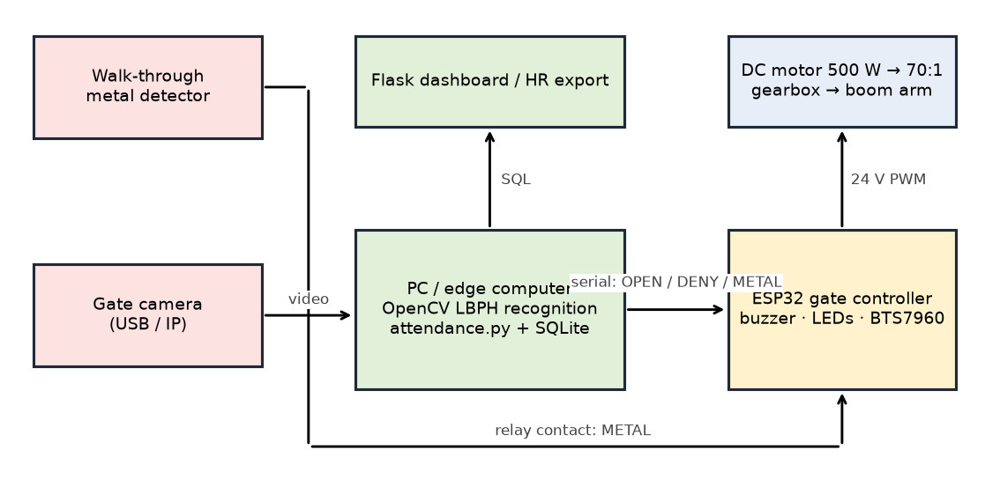{width=6.6in}

## 3.1 Mechanical Design

The mechanical subsystem was designed in SolidWorks and comprises (i) the boom arm and structural gate frame (`Structural_gate_design.SLDPRT`, handle and grip), (ii) a three-stage compound spur-gear reducer (`Gearbox_Design.SLDASM`) with six gears, four shaft lines and a casing, and (iii) the full assembly (`Overall_metal_detecting_gate_design.SLDASM`). Steel (ρ = 7850 kg/m³) is used for the gear and shaft mass/inertia estimates in `gate_params.m`.

### 3.1.1 Load Analysis

The boom arm is modeled as a uniform slender rod of mass *m* = 13.5 kg and length *L* = 1.0 m pivoted at one end at the gearbox output shaft, with its centre of mass at *L*<sub>c</sub> = *L*/2 = 0.5 m. Its inertia about the pivot is

$$J_{arm}=\tfrac{1}{3}mL^2=\tfrac{1}{3}(13.5)(1.0)^2 = 4.50\ \text{kg·m}^2.$$

If the arm were unbalanced, the static gravity torque about the pivot would be $T_{grav}(\theta)=m g L_c \cos\theta$, i.e. up to $(13.5)(9.81)(0.5)=66.22$ N·m at horizontal (Figure 3.1, right). As in commercial barriers, a **counterweight on the output hub** cancels this moment, so the drive sees only the arm's inertia and friction. The dynamic model (Section 3.2) therefore omits the gravity term; the 66.22 N·m figure is retained only as a static check of the motor margin should the counterbalance be omitted (Section 3.2.2).

The dynamic load is set by the motion profile: the peak torque at the arm shaft is $J_{eff}a_{pk}+b\,v_{pk}\approx 30$ N·m (Section 3.3.2).

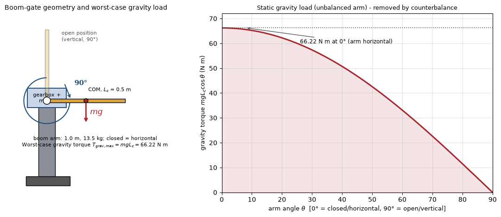{width=6.3in}

### 3.1.2 Gear-Train Design

**Ratio selection.** A 70:1 reduction is required to convert the motor's 2500 rpm rated speed to the low output speed of the barrier and to multiply torque. It is split into three manageable compound stages (Figure 3.2):

$$i_1=\frac{68}{17}=4.000,\qquad i_2=\frac{70}{16}=4.375,\qquad i_3=\frac{64}{16}=4.000,\qquad N=i_1i_2i_3=\mathbf{70.0:1}.$$

At the average move speed (90° in 2.5 s = 6 rpm at the output), the motor averages 420 rpm; at the peak profile speed the motor reaches ≈553 rpm — only 22 % of its 2500 rpm rated speed, leaving ample torque-speed headroom.

**Gear geometry.** All gears are full-depth involute spur gears. For module *m* and tooth count *z*: pitch diameter *d* = *mz*, outside diameter *d*<sub>a</sub> = *m*(*z*+2) and root diameter *d*<sub>f</sub> = *m*(*z*−2.5); these are the standard full-depth relations used to cross-check the SolidWorks parts. The centre distance of a stage is half the sum of the mating pitch diameters.

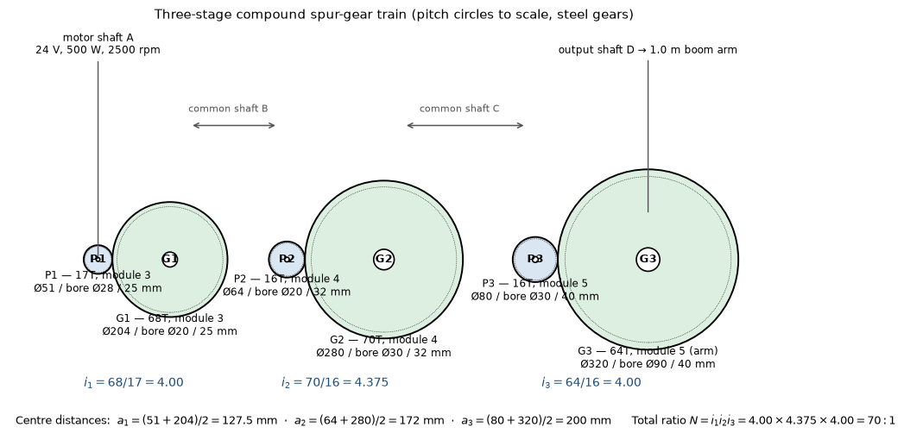{width=6.7in}

The complete gear geometry (columns taken from the SolidWorks-derived BOM in `gate_params.m`) and the analytically estimated steel masses and own-axis inertias (annular cylinder, $J=\tfrac12 m(R_o^2+R_i^2)$) are given in Table 3.1.

Table 3.1 – Gear-train geometry, mass and inertia

| Gear | *z* | Module (mm) | Pitch Ø (mm) | Outside Ø (mm) | Root Ø (mm) | Bore (mm) | Face (mm) | Mass (kg) | Own *J* (kg·m²) |
|:---|---:|---:|---:|---:|---:|---:|---:|---:|---:|
| P1, motor pinion | 17 | 3 | 51 | 57.0 | 43.5 | 28 | 25 | 0.280 | 0.00012 |
| G1, gear 1 | 68 | 3 | 204 | 210.0 | 196.5 | 20 | 25 | 6.353 | 0.03337 |
| P2, pinion 2 | 16 | 4 | 64 | 72.0 | 54.0 | 20 | 32 | 0.729 | 0.00041 |
| G2, gear 2 | 70 | 4 | 280 | 288.0 | 270.0 | 30 | 32 | 15.290 | 0.15156 |
| P3, pinion 3 | 16 | 5 | 80 | 90.0 | 67.5 | 30 | 40 | 1.356 | 0.00124 |
| G3, arm gear | 64 | 5 | 320 | 330.0 | 307.5 | 90 | 40 | 23.256 | 0.32122 |
| **Total gear mass** | | | | | | | | **47.26** | |

Stage centre distances are **127.5 mm** ((51+204)/2), **172 mm** ((64+280)/2) and **200 mm** ((80+320)/2); these set the shaft positions in the gearbox casing and are explicitly cross-checked against the SolidWorks assembly sketch in the simulation report.

**Efficiency and reflected inertia.** With η<sub>mesh</sub> = 0.96 per mesh, the overall drive efficiency is

$$\eta=0.96^3=\mathbf{0.885}.$$

Every rotating element is reflected to the slow output (arm) shaft using *J*<sub>ref</sub> = *J*(*n*/*n*<sub>out</sub>)². Relative to the output, shaft A (motor + P1) spins 70× faster, shaft B (G1 + P2) 17.5× faster, shaft C (G2 + P3) 4× faster, and shaft D (G3 + arm) at 1×. Summing the contributions:

$$J_{gearbox,ref}=\sum J_k\,n_k^2=\mathbf{13.69\ \text{kg·m}^2}.$$

The motor rotor (*J*<sub>rot</sub> = $6\times 10^{-4}$ kg·m²) reflects as *J*<sub>rot</sub>*N*² = 2.94 kg·m². Hence

$$J_{eff}=J_{arm}+J_{gearbox,ref}+J_{rot}N^2=4.50+13.69+2.94=\mathbf{21.13\ \text{kg·m}^2}.$$

The dominant reflected inertia is the large intermediate and final gears, which illustrates why the output-stage gear and arm shaft must be designed carefully and why the gear mass estimates are kept conservative.

### 3.1.3 Shaft Design

Four shaft lines correspond to the bores of Table 3.1: motor/input shaft A (modeled Ø27 mm, driving the Ø28-bore P1), compound shaft B (Ø20 mm, carrying G1 and P2), compound shaft C (Ø30 mm, carrying G2 and P3) and the output/arm shaft D (Ø90 mm hub bore on G3); a `minishaft` handles the motor coupling. Peak torque at each shaft is conservatively found by reflecting a 100 N·m output torque (≈3× the simulated 30 N·m peak of Section 4.1, covering an un-counterbalanced arm) back through the stages with 0.96 mesh efficiency; the "holding" column uses the 66.22 N·m static gravity torque of an unbalanced arm.

Shaft sizing is checked with the torsion formula used in the guideline,

$$\tau_{max}=\frac{16T}{\pi d^3},$$

giving the values in Table 3.2. Even at peak torque the largest shear stress is ≈5 MPa, far below the allowable shear of structural/mild steel (roughly 0.5 *S*<sub>y</sub>/*n* ≈ 40–80 MPa with *S*<sub>y</sub> ≈ 250 MPa and a conservative factor), so the shaft diameters are set mainly by gear bores, deflection limits, keyway capacity and bearing bore standards. Parallel keys and keyways (modeled in the SolidWorks parts) transmit torque between each gear/shaft pair, and shafts are located with shoulders and retaining elements.

Table 3.2 – Shaft speeds, torques and torsional shear stress

| Shaft | Carries | Speed vs output | Modeled Ø (mm) | Holding torque (N·m) | Peak torque (N·m) | Peak τ (MPa) |
|:--|:--|--:|--:|--:|--:|--:|
| A (input) | motor + P1 | 70× | 27 | 1.07 | 1.63 | 0.42 |
| B | G1 + P2 | 17.5× | 20 | 4.11 | 6.25 | 3.98 |
| C | G2 + P3 | 4× | 30 | 17.24 | 26.25 | 4.95 |
| D (output) | G3 + arm | 1× | 90 | 66.22 | 100.78 | 0.70 |

### 3.1.4 Bearing Selection

Radial deep-groove ball bearings are selected from the shaft diameters and checked with the standard L10 rating life used in the guideline,

$$L_{10}=\left(\frac{C}{F}\right)^3 10^6\ \text{rev}.$$

The output-shaft bearing carries the largest static radial load — approximately half the arm weight plus half the 23.3 kg final gear, *F*<sub>r</sub> ≈ 180 N. Selecting a conservatively rated 6204-class bearing (*C* ≈ 12.8 kN) gives

$$L_{10}=\left(\frac{12\,800}{180}\right)^3 10^6 \approx 3.6\times10^{11}\ \text{rev},$$

which at the 6 rpm average output speed corresponds to a life far beyond any practical duty cycle; static capacity and mounting geometry, rather than fatigue life, govern the final selection. Intermediate and input bearings are lighter-series units matched to the Ø20/Ø27/Ø30 journals and the gear face widths.

### 3.1.5 Housing and Gate Structure

The steel `casing for gear box` encloses the three stages on the centre distances of Section 3.1.2, provides bearing bores on parallel walls, a mounting face for the motor (P1 on shaft A) and an output seal around shaft D. The `Structural_gate_design` forms the vertical pedestal and baseplate that hold the gearbox at arm-pivot height, with a `handle` and `grip` providing the manual release required to raise the arm during power loss or maintenance. A counterweight on the output hub balances the arm (the design assumption of the dynamic model); should it be omitted, the motor's 56 % holding-torque margin (Section 3.2.2) still covers the static load.

### 3.1.6 Fabrication and Assembly

Planned fabrication follows conventional light-engineering practice: CNC/turning of the four shafts and gear blanks, gear cutting (milling/hobbing) to the modules of Table 3.1, boring and keyway slotting, welding and machining of the pedestal and baseplate, and milling/drilling of the casing bearing bores so that the shaft axes are parallel at 127.5/172/200 mm spacing. Assembly proceeds shaft-by-shaft (press-fit gears with keys, bearings into casing bore seats, shimming for mesh backlash, motor alignment to shaft A, final gear G3 to the arm output hub), after which the arm is mounted and the no-load and balanced torque checks are performed before electrical commissioning.

## 3.2 Mathematical Modeling

### 3.2.1 Mechanical Dynamics of the Arm and Gearbox

Taking θ as the output-shaft (arm) angle and reflecting all rotating inertia to that shaft, the rotational Newton equation is

$$\boxed{\,J_{eff}\ddot{\theta}+b\,\dot{\theta}=\tau_{out}\,}$$

with *J*<sub>eff</sub> = 21.13 kg·m² and the lumped viscous friction *b* = 1.2 N·m·s/rad (arm counter-balanced, no gravity term). The gearbox output torque delivered by the motor current *i* is

$$\tau_{out}=N\eta K_t i,$$

where *K*<sub>t</sub> is the motor torque constant and η = 0.885.

### 3.2.2 DC Motor Electrical Model

The armature circuit of the brushed PMDC motor is

$$L\frac{di}{dt}=V-Ri-K_e N\dot{\theta},$$

with the back-EMF referred through the gearbox ($K_e N\dot{\theta}$). The motor constants in `gate_params.m` for the 24 V, 500 W, 2500 rpm unit are:

$$\omega_{rated}=\frac{2500\cdot2\pi}{60}=261.8\ \text{rad/s},\qquad T_{rated}=\frac{500}{261.8}=1.91\ \text{N·m},$$

$$K_t=K_e=\frac{V-I_{rated}R}{\omega_{rated}}=\frac{24-(27)(0.15)}{261.8}=\mathbf{0.0762\ \text{N·m/A (V·s/rad)}}.$$

The dynamic torque requirement referred to the motor is $30/(70\times0.885)=\mathbf{0.48\ \text{N·m}}$ — 25 % of the 1.91 N·m rating — at a cruise speed of $0.827\times70\approx553$ rpm (22 % of rated). As a static margin check, an *un-counterbalanced* arm would require

$$T_{hold,m}=\frac{T_{grav,max}}{N\eta}=\frac{66.22}{70(0.885)}=1.07\ \text{N·m},$$

i.e. **56 %** of rated torque; the chosen motor therefore covers both cases.

### 3.2.3 State-Space Representation

Because the driver is current-controlled (Section 3.3.3) the electrical time constant $L/R=3.3$ ms is negligible against the ≈1 s mechanical dynamics, and the design plant is the torque-input model with state $\mathbf{x}=[\theta,\ \omega]^T$:

$$\dot{\mathbf{x}}=\begin{bmatrix}0&1\\0&-b/J_{eff}\end{bmatrix}\mathbf{x}+\begin{bmatrix}0\\1/J_{eff}\end{bmatrix}\tau,\qquad y=[1\ \ 0]\,\mathbf{x}.$$

Open-loop transfer function $G(s)=\theta/\tau=1/(J_{eff}s^2+b\,s)$ with poles at $s=0$ and $s=-b/J_{eff}=-0.057$ rad/s — **marginally stable**, so position feedback is mandatory. The controllability matrix $[B\ \ AB]$ and observability matrix $[C;\ CA]$ both have rank 2 (checked numerically in `gate_analysis.m`).

## 3.3 Controller Design

### 3.3.1 Open-Loop Response Analysis

Without control the plant is a free integrator with light damping: a constant torque makes the arm accelerate to a terminal speed $\tau/b$ and keep turning, and it never returns to a commanded angle (left panel of Figure 4.3, 5 N·m step). Feedback control is therefore mandatory, and the open-loop plant cannot meet any positional specification.

### 3.3.2 Motion Reference: Trapezoidal Profile

A symmetric trapezoidal velocity profile commands the 90° (π/2 rad) move in *T*<sub>move</sub> = 2.5 s with acceleration time *T*<sub>a</sub> = 0.6 s (function handle `P.ref(t)` in `gate_params.m`). The peak velocity and acceleration are

$$v_{pk}=\frac{\theta_{target}}{T_{move}-T_a}=\frac{\pi/2}{1.9}=0.827\ \text{rad/s}=47.4°/\text{s},$$

$$a_{pk}=\frac{v_{pk}}{T_a}=1.378\ \text{rad/s}^2.$$

The finite constant-acceleration segments bound the torque requirement at $J_{eff}a_{pk}+b\,v_{pk}=29.1+1.0\approx30$ N·m at the output. Figure 4.2 plots the reference angle, speed and acceleration.

### 3.3.3 Control Strategy Selection

With the arm counter-balanced the plant is linear and a plain **PID** is sufficient; LQR/state feedback was considered but offers no benefit for a second-order plant with a single output and would complicate the embedded implementation. The chosen structure (mirrored block-for-block in `gate_pid.slx`, Figure 3.3) is:

- **PID feedback** on the angle error, with the derivative term acting on the *speed* error $\omega_{ref}-\omega$ (the trapezoidal profile supplies $\omega_{ref}$), which avoids derivative kick;
- **current and voltage saturation** (±30 A driver, ±24 V supply) and **back-EMF/resistive-drop compensation** in the voltage command;
- **anti-windup** by clamping the integral term to ±300 N·m — in Simulink this is simply the integrator block's own output limit, so no extra logic is needed.

The output-side torque command is

$$\tau_{cmd}=K_p e+K_i\!\int e\,dt+K_d(\omega_{ref}-\omega),\qquad e=\theta_{ref}-\theta.$$

It is referred to the motor and limited:

$$i_{cmd}=\mathrm{sat}_{\pm 30\,A}\!\left(\frac{\tau_{cmd}}{N\eta K_t}\right),$$
$$V_{cmd}=\mathrm{sat}_{\pm 24\,V}\!\left(i_{cmd}R+K_e N\omega\right).$$

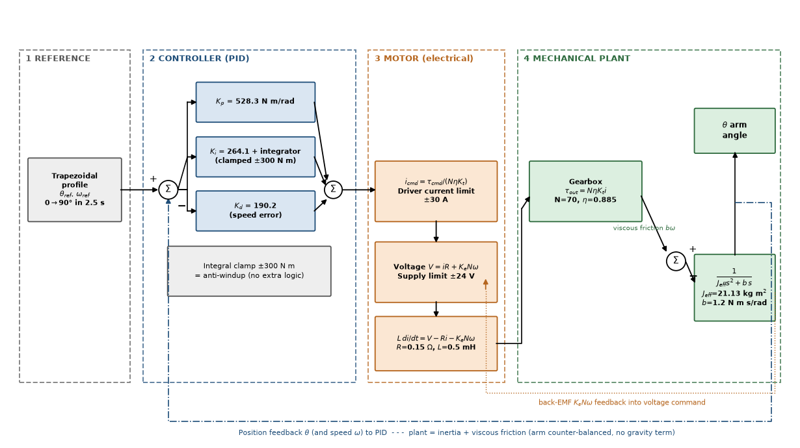{width=7.0in}

### 3.3.4 PID Gain Synthesis

The torque-input plant $J_{eff}\ddot{\theta}+b\dot{\theta}=\tau$ with PD action places the closed-loop characteristic equation

$$J_{eff}s^2+(b+K_d)s+K_p=0\quad\Longleftrightarrow\quad s^2+2\zeta\omega_n s+\omega_n^2=0.$$

Choosing a bandwidth ω<sub>n</sub> = 5 rad/s and damping ratio ζ = 0.9 (near critically damped, to avoid overshoot at the stops), the standard second-order design in `gate_params.m` gives

$$K_p=J_{eff}\omega_n^2=21.13(25)=\mathbf{528.3\ \text{N·m/rad}},$$

$$K_d=2\zeta\omega_n J_{eff}=2(0.9)(5)(21.13)=\mathbf{190.2\ \text{N·m·s/rad}},$$

$$K_i=\frac{K_p\omega_n}{10}=\mathbf{264.1\ \text{N·m/(rad·s)}}.$$

With the PD terms alone the poles would sit at $-\zeta\omega_n \pm j\omega_n\sqrt{1-\zeta^2}=-4.5\pm j2.2$ rad/s. Including *K*<sub>i</sub> the closed loop is third order, $J_{eff}s^3+(b+K_d)s^2+K_p s+K_i=0$, with poles at **−4.21 ± j1.38 rad/s** (ω<sub>n</sub> = 4.4 rad/s, ζ = 0.95) and a slow real pole at **−0.64 rad/s** that governs the final creep to zero error (`gate_analysis.m`, Figure 4.6). All poles are in the left half-plane and the response is near-critically damped — appropriate for a barrier that must stop crisply without slamming. Table 3.5 summarizes the controller.

Table 3.3 – DC motor and drive parameters (`gate_params.m`)

| Parameter | Value | Parameter | Value |
|:--|--:|:--|--:|
| Supply voltage | 24 V | Rated speed | 2500 rpm (261.8 rad/s) |
| Rated power | 500 W | Rated torque | 1.91 N·m |
| Rated current | 27 A | Armature R (est.) | 0.15 Ω |
| Armature L (est.) | 0.5 mH | *K*<sub>t</sub> = *K*<sub>e</sub> | 0.0762 N·m/A |
| Rotor inertia (est.) | $6\times 10^{-4}$ kg·m² | Driver current limit | ±30 A |
| Gear ratio *N* | 70:1 | Gear efficiency η | 0.885 |

Table 3.4 – Electronic bill of materials (read from the Proteus project netlist, `ROOT.CDB`)

| Ref | Component / value | Function |
|:--|:--|:--|
| ARD1 | Arduino Uno R3, ATmega328P, 16 MHz | Controller: sensing, logic, motor sequencing |
| U2 | LM358N dual op-amp (DIL08) | LC-tank comparator / buffer |
| L1 | 3.9 µH inductor | Simulated metal-detector search coil |
| C1 | 22 nF capacitor | LC tank capacitor |
| RV1 | 1 kΩ potentiometer (POT-HG) | Sensitivity / threshold ("passing metal" dial) |
| D1 + R3 | Red LED + 220 Ω | Metal detected / alarm indication |
| D2 + R4 | Green LED + 220 Ω | Ready / clear indication |
| BUZ1 | Piezo buzzer, 5 V, 500 Hz | Audible alarm |
| P1 | COMPIM virtual serial, 9600 8N1 | Telemetry / event logging |
| — | 24 V H-bridge (BTS7960-class, ±30 A) | Gate motor power stage |

The tank resonance with the chosen values is $f_0=1/(2\pi\sqrt{LC})=1/(2\pi\sqrt{3.9\,\mu\mathrm{H}\times 22\,\mathrm{nF}})\approx \mathbf{543\,kHz}$; a nearby metal object shifts this frequency, and the LM358 comparator reports the shift against the RV1 threshold. Each LED series resistor limits current to (*V*<sub>F</sub>-logic drop)/R ≈ (5 − 2.2)/220 ≈ 12.7 mA, matching the LED's ≈10 mA design current.

Table 3.5 – Controller and profile parameters

| Parameter | Value | Parameter | Value |
|:--|--:|:--|--:|
| Move angle | 90° (π/2 rad) | *T*<sub>move</sub> | 2.5 s |
| Accel. time *T*<sub>a</sub> | 0.6 s | Peak speed | 47.4°/s |
| Peak acceleration | 1.378 rad/s² | *K*<sub>p</sub> | 528.3 N·m/rad |
| *K*<sub>i</sub> | 264.1 N·m/(rad·s) | *K*<sub>d</sub> | 190.2 N·m·s/rad |
| ω<sub>n</sub>, ζ | 5 rad/s, 0.9 | Closed-loop poles | −4.21 ± j1.38, −0.64 rad/s |
| Integral clamp | ±300 N·m | Sample/solver step | 1 ms |

### 3.3.5 Control Architecture and Embedded Implementation

Figure 3.3 shows the complete signal architecture. In hardware the **ESP32** gate controller (`software/esp32_gate/esp32_gate.ino`) reads the metal-detector relay contact, implements a CLOSED → OPENING → OPEN → CLOSING state machine driven by two limit switches and a 6 s auto-close timer, drives the BTS7960 H-bridge with PWM, sounds the buzzer/LEDs, and exchanges one-line messages with the PC over USB serial (`METAL:1/0` out; `OPEN`, `DENY`, `CLOSE` in). The gains of Table 3.5 are the starting point for the closed position loop once an output-shaft encoder is fitted (Recommendation 1). Table 3.6 gives the pin map; the same circuit is provided as a Wokwi `diagram.json` for browser simulation.

Table 3.6 – ESP32 gate-controller pin map

| Signal | GPIO | Type | Notes |
|:--|--:|:--|:--|
| Metal-detector relay contact | 34 | input, pull-up | active LOW; edge → `METAL:1/0` + local alarm |
| Limit switch – gate OPEN | 32 | input, pull-up | ends OPENING state |
| Limit switch – gate CLOSED | 33 | input, pull-up | ends CLOSING state |
| Buzzer | 25 | output | 2 kHz on metal, 3 × 1.5 kHz on `DENY` |
| Alert LED (red) | 26 | output | follows metal state |
| OK LED (green) | 27 | output | on while gate open |
| BTS7960 RPWM (open) | 18 | PWM | duty 180/255 |
| BTS7960 LPWM (close) | 19 | PWM | duty 180/255 |
| USB serial to PC | TX0/RX0 | 115200 baud | line protocol |

## 3.4 Electrical and Electronic System Design

The electronic system (`electrical/electrical system.pdsprj`) is organized into four functional groups shown in Figure 3.4:

1. **Sensor front-end** — the L1 (3.9 µH) search-coil inductor with C1 (22 nF) forms the LC resonant tank; the LM358 (U2) conditions/compares the signal against the threshold set by RV1 (1 kΩ), which in simulation stands in for a passing metal object.
2. **Controller** — in the Proteus co-simulation an Arduino Uno R3 (ATmega328P, 16 MHz) reads the analog condition and runs the detection logic; in the system design this role is taken by the ESP32 of Table 3.6, which additionally sequences the gate motor and talks to the PC.
3. **Indicators and telemetry** — red LED D1 (+220 Ω R3) for metal/alarm, green LED D2 (+220 Ω R4) for clear/ready, the 500 Hz buzzer BUZ1 for the audible alarm, and the COMPIM serial gateway P1 (9600 baud, 8 data bits, no parity, 1 stop bit) for telemetry.
4. **Actuator power stage** — the 24 V/500 W brushed gearmotor is driven by a ±30 A H-bridge (BTS7960-class), powered from a separate 24 V rail while the logic runs from +5 V/GND/VCC rails (as defined in the project's `PWRRAILS.DAT`).

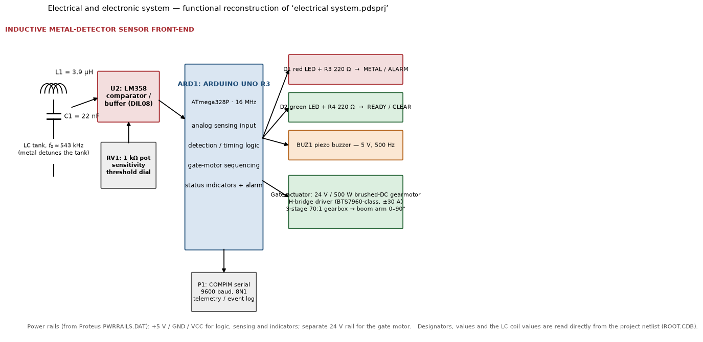{width=6.8in}

The Proteus project includes a compiled Arduino program (`metal_gate_detector…ino.hex`) bound to the Arduino model, demonstrating the intended firmware deployment; the bundled 80C31 assembly file is the new-project wizard boilerplate. Protection and safety in the hardware design include the driver current limit (matching the ±30 A saturation of the model), reverse-voltage and flyback protection at the motor, decoupling on the logic supply, opto/directional interlocks so the H-bridge cannot cross-conduct, and a manual release via the gate handle.

## 3.5 Software Design: Identification, Logging and Dashboard

### 3.5.1 Worker identification (OpenCV)

The identification pipeline (`software/attendance/`, Python 3 + `opencv-contrib-python`) is: camera frame → grayscale → Haar-cascade face detection (`haarcascade_frontalface_default.xml`, bundled) → crop, resize to 200 × 200 px, histogram equalisation → **LBPH** prediction (radius 1, 8 neighbours, 8 × 8 grid) → distance threshold (70; lower = better match). A recognition is accepted only when the same ID is seen in **5 consecutive frames**, and the same worker is not re-logged within a **60 s lockout**, so one person walking through the gate produces exactly one record. Unknown faces are boxed in red and `DENY` is sent to the gate controller.

Enrolment (`enroll.py`) captures 30 samples per worker from the webcam or from a folder of photos into `data/faces/<id>_<name>/`; `train.py` trains the LBPH model, writes `lbph_model.yml` + `labels.json` and registers the worker in the database. All thresholds live in `config.py`.

### 3.5.2 Entry/exit logging

`db.py` maintains two SQLite tables: `workers(emp_id, name, label)` and `attendance(emp_id, name, event IN|OUT, ts, confidence, metal)`. Each accepted recognition **toggles** the worker's state (IN → OUT → IN …) and stores whether the metal detector was active within the previous 5 s (`gate_link.py` holds the `METAL:1` message for that long). The metal flag is *recorded, not used to block the gate*: in a metal factory it will trigger often, and the blocking policy belongs to the security operator.

### 3.5.3 Dashboard

`dashboard.py` (Flask) serves a page with the per-worker first-IN / last-OUT / hours for a selected day and the latest events, highlighting rows with a metal alert, and exposes `/api/events` and `/api/summary?day=YYYY-MM-DD` as JSON for HR-system integration. Table C.1 lists all modules.

## 3.6 Simulation Build versus Real-World Build

Both builds share the four subsystems; Table 3.7 maps each to what was built in this project (zero hardware cost) and to the industrial components it stands in for.

Table 3.7 – Simulation build versus real-world build, per subsystem

| Subsystem | Simulation build (this project) | Real-world build |
|:--|:--|:--|
| Metal detection | Push-button / software flag on the ESP32 in **Wokwi**; LC-tank + LM358 front-end co-simulated in **Proteus** | Walk-through metal detector (Garrett PD 6500i, CEIA, or OEM) with adjustable **zone sensitivity** and a relay/alarm contact read by the controller |
| Worker identification | Laptop webcam + **OpenCV LBPH**; SQLite of enrolled face samples | Low-light **PoE IP camera** (Hikvision/Dahua) or a face-recognition camera (Hikvision DeepinView); edge compute (NVIDIA Jetson Nano/Orin or mini-PC) running a deep-embedding model; **RFID badge or fingerprint as secondary ID** because masks, goggles and helmets defeat face recognition |
| Entry/exit logging & controller | ESP32 in Wokwi → serial → Python backend → **SQLite/CSV** → **Flask dashboard** | **Access-control panel** (ZKTeco, Hikvision) or PLC / ruggedised PC; tripod or full-height **turnstile** or motorised barrier with electric lock; **PostgreSQL** or vendor HR/attendance backend; PoE switches and cabling to a server room |
| Alerts & environment hardening | Buzzer + LEDs in Wokwi | Alarm **strobe/siren** on detector trigger; **IP-rated enclosures** for detector and camera electronics (dust, metal shavings, heat); **UPS** for the controller against surges from heavy machinery |

**Key environmental risk.** A metal factory is the hard case for a metal detector: workers legitimately carry tools, and clothing and skin carry metal-dust residue, so a security-grade sensitivity setting will alarm constantly. The design decision to make *early* is whether the detector's job is **security screening** (catch theft → tuned sensitivity zones plus badge/RFID double-check) or merely a **presence trigger** that tells the camera to look (low sensitivity). Iron-Watch supports both: the detector state is simply attached to the attendance record, and the sensitivity policy is set on the detector itself.

```{=openxml}
<w:p><w:r><w:br w:type="page"/></w:r></w:p>
```

```{=latex}
\newpage
```

# 4. Simulation and Virtual-Prototyping Results and Discussion

## 4.1 Simulation Results and Analysis

Two consistent simulation implementations were run: the dependency-free script `gate_sim.m` (fixed-step 1 ms Euler, opening move, PID) and the Simulink model `gate_pid.slx` generated by `build_gate_simulink.m` (Figure 4.1; 30 blocks in four labelled sections, solver ode4 at 1 ms), plus a full open/close cycle (RK4) and a worst-case plant run. Every result below was reproduced independently in Python (`Report/tools/run_sim.py`) and the raw data are in `Report/data`.

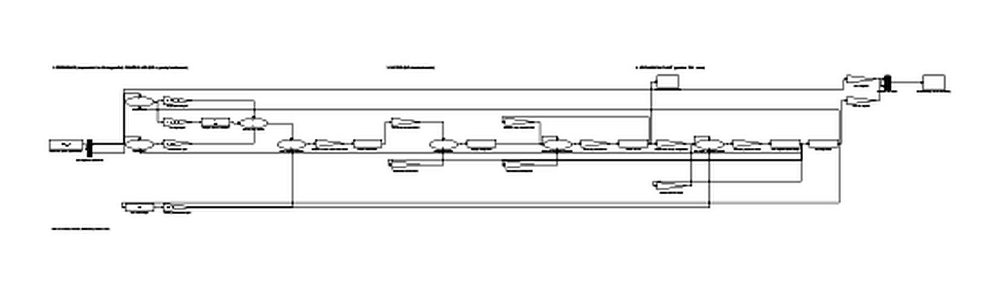{width=6.8in}

**Design report (console output of `gate_sim.m` / `gate_analysis.m`).** Total ratio 70.0:1; η = 0.885; gear masses and inertias as Table 3.1 (total gear mass 47.26 kg); reflected gearbox inertia 13.69 kg·m²; effective output inertia 21.13 kg·m² (arm 4.50 + gearbox 13.69 + rotor 2.94); peak torque 30 N·m at the arm = 0.48 N·m at the motor (25 % of rated); gains *K*<sub>p</sub> = 528.3, *K*<sub>i</sub> = 264.1, *K*<sub>d</sub> = 190.2; open-loop poles 0 and −0.057; closed-loop poles −4.21 ± j1.38, −0.64.

**Reference profile.** Figure 4.2 shows the trapezoidal position/speed/acceleration trajectory: 0.6 s acceleration, 1.3 s constant-velocity cruise and 0.6 s deceleration, reaching exactly 90°.

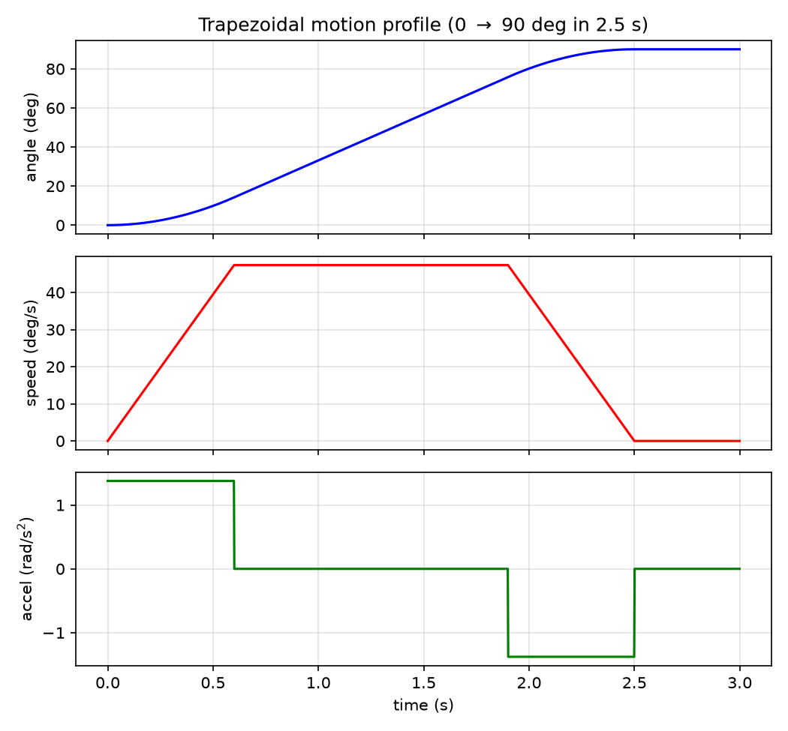{width=6.2in}

**Open loop versus closed loop.** Figure 4.3 contrasts the uncontrolled arm (turning away indefinitely under a 5 N·m torque step — the pole at the origin) with the PID closed loop, which follows the reference smoothly to 90° and holds it.

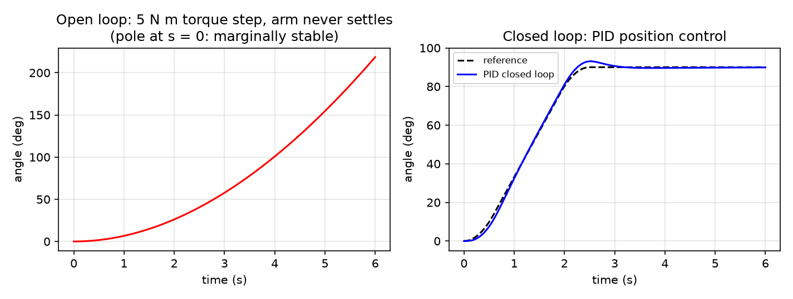{width=6.6in}

**Opening move (faithful reproduction of `gate_sim.m`).** Figure 4.4 shows the arm angle versus reference, the tracking error and the motor current over 6 s. The arm accelerates with the reference (peak lag 2.62° at t ≈ 0.62 s), tracks through the cruise, briefly overshoots to 93.1° as it decelerates into the stop, and settles to 89.88° (0.12° residual, being removed by the slow integral pole). Motor current peaks at only **7.4 A** during acceleration, reverses to brake near the end of the move and falls to ≈0 A at rest — with a balanced arm no holding current is needed. Figure 4.5 shows the speed tracking and the implied terminal voltage, which peaks at 5.3 V against the 24 V supply. The 30 A driver limit is never approached.

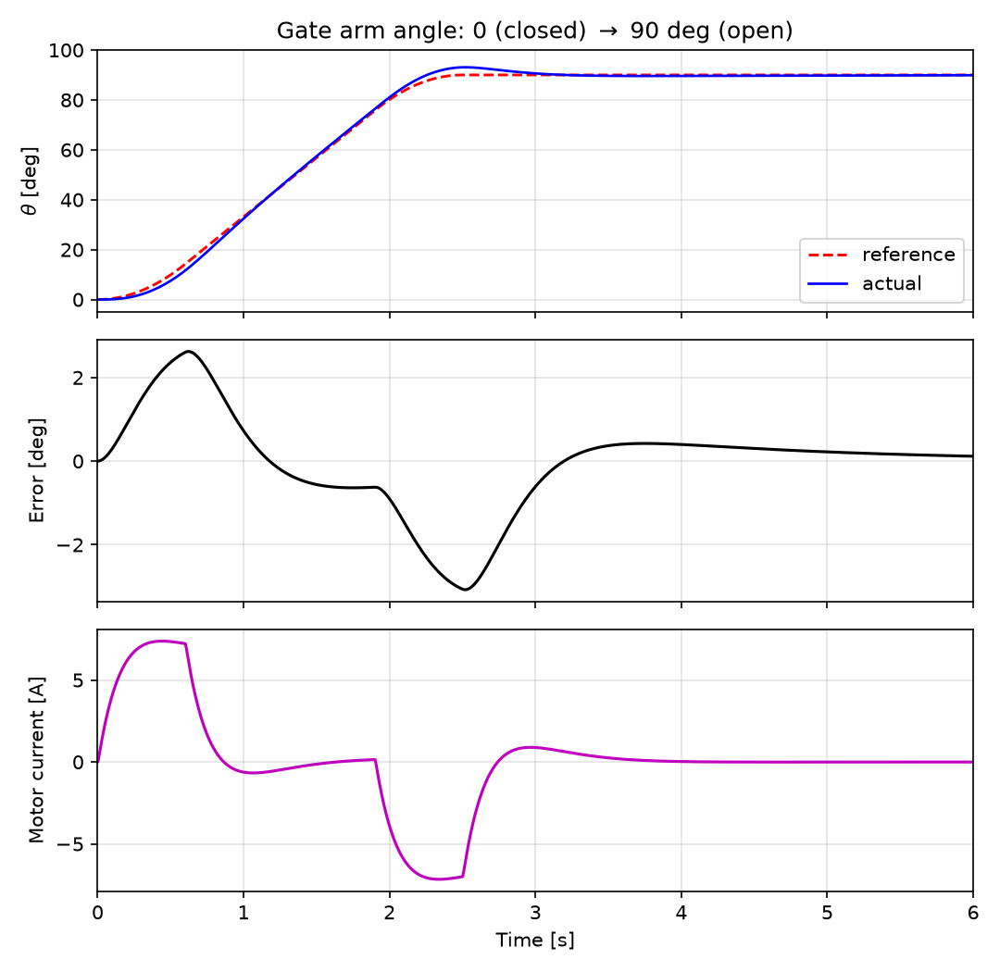{width=6.1in}

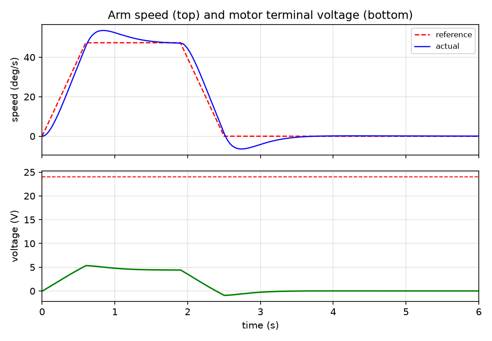{width=6.0in}

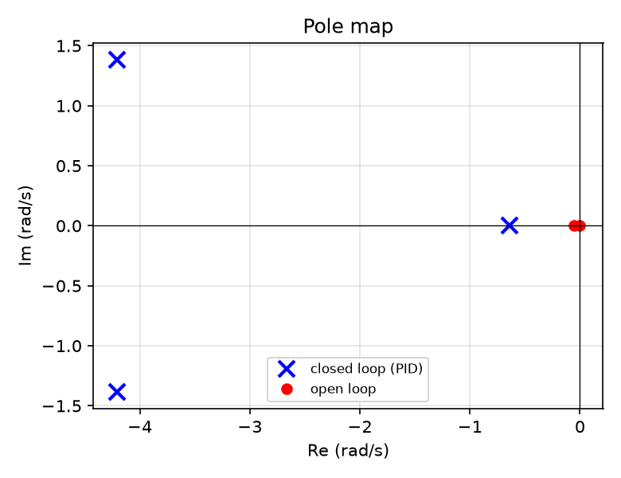{width=4.2in}

Table 4.1 quantifies the nominal opening move.

Table 4.1 – Nominal opening-move performance

| Metric | Value |
|:--|--:|
| Final angle (target 90°) | 89.88° |
| Peak tracking lag (during acceleration) | 2.62° |
| Maximum angle (overshoot at stop, t = 2.52 s) | 93.08° (3.08°) |
| Settling time to ±0.5° (from move start) | 3.03 s |
| RMS error during the 2.5 s move | 1.54° |
| Residual error at t = 6 s | 0.12° |
| Peak motor current (limit 30 A) | 7.38 A |
| Peak terminal voltage (supply 24 V) | 5.3 V |

**Full open/close cycle.** The same PID executes dwell–open–dwell–close over 16 s (Figure 4.7). The open and close moves are mirror images (peak error 3.1°, RMS 1.55° opening and 1.55° closing), motor torque peaks at **0.56 N·m** (29 % of rated), current at **7.4 A** and terminal voltage at **5.3 V**, leaving most of the 24 V supply in reserve. The symmetry confirms that, with the balanced-arm model, direction has no effect on the drive demand.

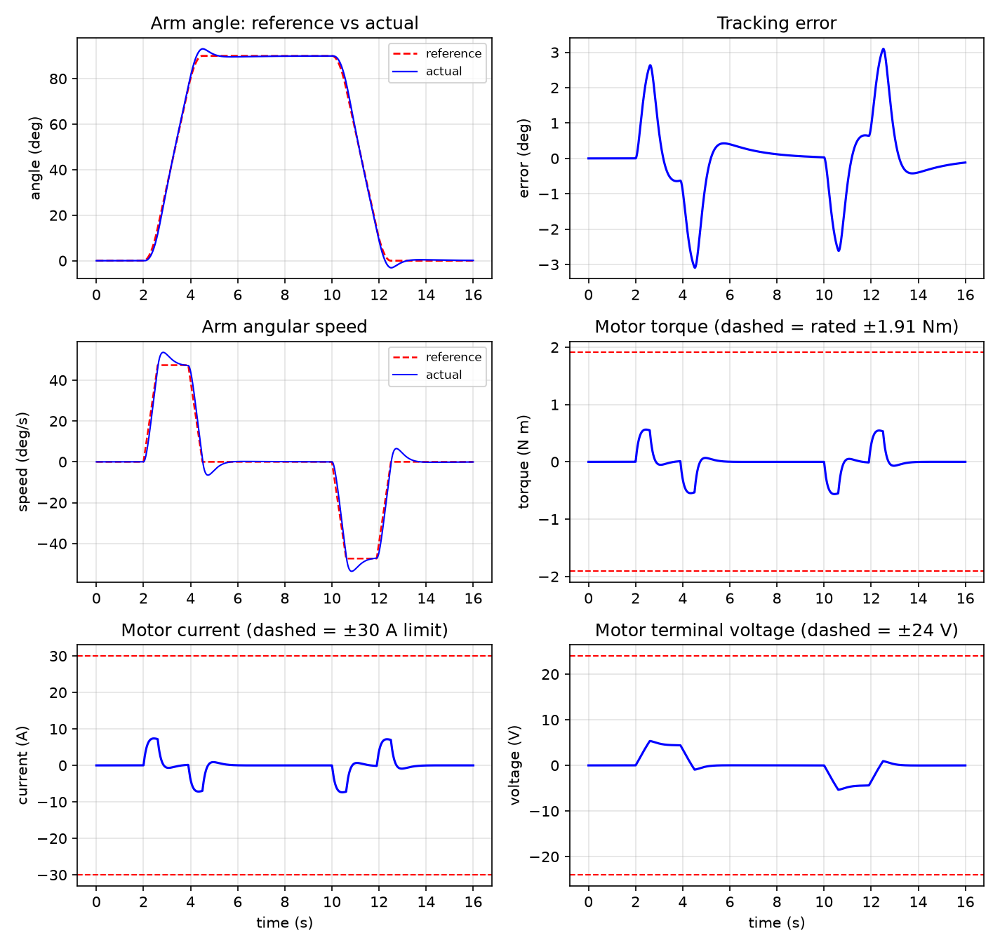{width=6.7in}

```{=openxml}
<w:p><w:r><w:br w:type="page"/></w:r></w:p>
```

## 4.2 Prototype Results

Because the physical gate is the next project phase, experimental validation was performed on the software and embedded prototypes.

**Identification and logging prototype.** The software chain was tested end-to-end on a workstation: two workers were enrolled from photographs, the LBPH model was trained, and recognition was tested on brightness-perturbed copies of the enrolment images plus one unseen person (Table 4.4). Attendance toggling, the metal flag and the dashboard endpoints were exercised through the same code path as the live loop.

Table 4.4 – Face-recognition and attendance-logging test results

| Test | Result |
|:--|:--|
| Enrol two workers from photos (`enroll.py --from-folder`) | 1 face sample each detected, cropped and stored |
| Train LBPH (`train.py`) | 2 labels, model + labels written, workers registered in DB |
| Recognise enrolled worker A (brightness +10 %, +10 levels) | Worker A, distance 16.9 < 70 → **accepted** |
| Recognise enrolled worker B | Worker B, distance 9.8 < 70 → **accepted** |
| Unknown person | nearest match distance 76.6 > 70 → **rejected (UNKNOWN)** |
| Logging sequence E001, E002 (metal), E001 | IN, IN (metal = 1), OUT — toggling correct |
| Daily summary / dashboard | first-IN, last-OUT, hours and metal count computed; HTTP 200; JSON API served |

**ESP32 gate controller.** The firmware compiles for the ESP32 Arduino core and is exercised in Wokwi with the supplied `diagram.json`: pressing the METAL button produces `METAL:1` on the serial monitor, lights the red LED and sounds the buzzer; typing `OPEN` starts the motor PWM until the LIMIT OPEN button is pressed, after which the gate auto-closes after 6 s until LIMIT CLOSED; `DENY` gives three short beeps.

**Metal-detector front-end.** The analog front-end was additionally validated as a **microcontroller-in-the-loop virtual prototype** in Proteus:

- The schematic of Figure 3.4 was captured with the exact BOM of Table 3.4 and the +5 V/GND/VCC power rails.
- The compiled application firmware (`.hex`) is bound to the Arduino Uno R3 model, which executes the ATmega328P instruction set in co-simulation (16 MHz), reading the simulated LC/comparator channel and driving D1/D2, BUZ1 and the serial gateway.
- The RV1 potentiometer acts as a repeatable stimulus for the signal change produced by a passing metal object (the schematic annotation: *"Sensitivity dial – manually simulates changing signal from a passing metal object"*; the L1/C1 network is annotated *"Simulated sensor coil (LC tank) – represents real induction coil"*).
- Detection events are observed through the red/green LEDs, the 500 Hz buzzer and the 9600-baud COMPIM telemetry channel; the motor sequencing PWM/direction outputs are generated for the external 24 V H-bridge.

**Mechanical virtual prototype.** The SolidWorks assemblies `Gearbox_Design.SLDASM` and `Overall_metal_detecting_gate_design.SLDASM` integrate every part of the CAD manifest (Table A.1), providing interference checks, the shaft-centre layout (127.5/172/200 mm), mass-property cross-checks against Table 3.1 and the geometry needed for fabrication drawings.

**Hardware test procedure (planned for the prototype).** (1) Measure the motor's R, L and no-load constants and update `gate_params.m`; (2) bench-test the LC tank frequency shift with calibrated metal targets and set the detector threshold; (3) load the Table 3.5 gains into the ESP32 position loop and run the motor uncoupled to verify PWM/current limit; (4) couple the gearbox, fit the counterweight, check mesh and direction, and run low-speed moves; (5) execute the trapezoidal 90° move, logging angle (encoder), current and voltage; (6) enrol 30 samples per worker under gate lighting and measure recognition rate with and without PPE; (7) run repeated open/close cycles and verify fail-safe manual release and alarm behaviour.

## 4.3 Discussion

**Robustness.** A deliberately pessimistic plant — +20 % effective inertia and double the viscous friction — was run with the *same* nominal gains (Figure 4.8, Table 4.2). The controller remains stable with no limit saturation: overshoot rises modestly to 3.72°, move RMS error to 1.86°, settling to 3.94 s and peak current to 9.2 A, still far below the 30 A driver limit. This demonstrates ample gain margin against fabrication tolerances, added hardware (wiring, sensors, counterweight mismatch) and friction uncertainty.

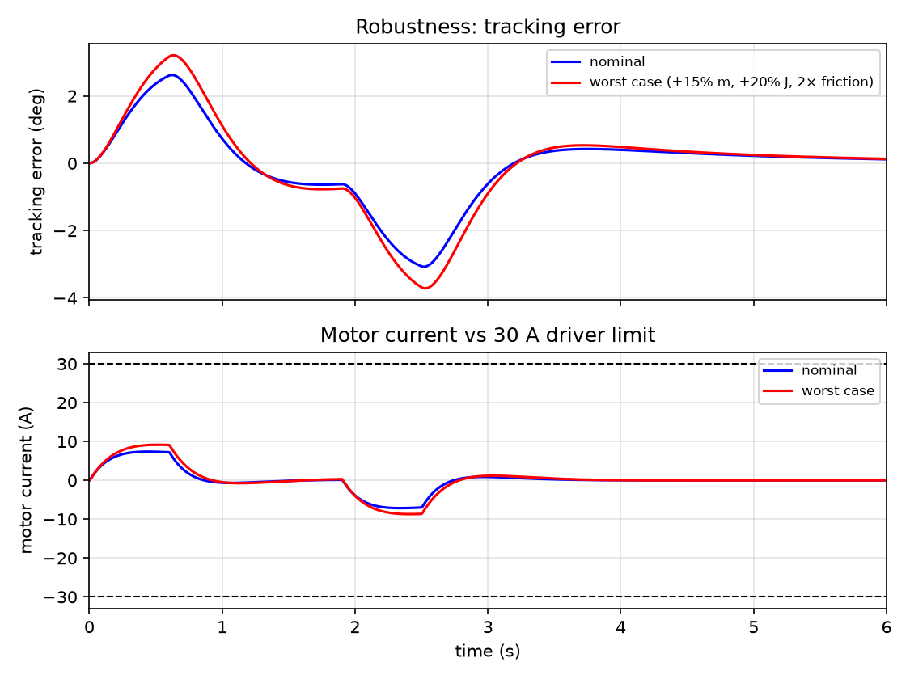{width=6.2in}

Table 4.2 – Nominal versus worst-case plant (opening move)

| Metric | Nominal | Worst case |
|:--|--:|--:|
| Overshoot at stop | 3.08° | 3.72° |
| RMS error during move | 1.54° | 1.86° |
| Settling time (±0.5°) | 3.03 s | 3.94 s |
| Final angle | 89.88° | ≈90° (stable) |
| Peak motor current | 7.38 A | 9.15 A |

Table 4.3 – Actuator limit check (full cycle)

| Quantity | Peak used | Limit / rating | Margin |
|:--|--:|--:|--:|
| Motor torque | 0.56 N·m | 1.91 N·m rated | 71 % free |
| Motor current | 7.4 A | 30 A driver | 75 % free |
| Terminal voltage | 5.3 V | 24 V supply | 78 % free |
| Static holding torque if un-counterbalanced (motor) | 1.07 N·m | 1.91 N·m rated | 44 % free |

**Interpretation.** With a balanced arm the 500 W motor is generously sized: the nominal trajectory uses 29 % of rated torque, 25 % of the driver current and 22 % of the supply voltage. The margin is deliberate — it covers an un-counterbalanced arm (gravity feed-forward of up to 66 N·m), wind load on a 1 m arm, Coulomb friction and supply sag, and it allows a faster move profile if required.

**Simulation versus expected hardware.** The 3.1° overshoot into the 90° stop arises because the feedback PID alone must supply the deceleration torque and briefly over-corrects; the slow integral pole (−0.64 rad/s) then removes the residual. If a crisper stop is needed, an acceleration feed-forward $J_{eff}\ddot{\theta}_{ref}$ (one extra gain block on the reference acceleration) removes most of it without changing the feedback gains.

**Face recognition.** LBPH with one sample per worker already separates enrolled from unknown faces by a margin of ≈60 distance units (Table 4.4), but production enrolment must use 30+ samples per worker under the gate's own lighting. Helmets, dust masks and goggles reduce the usable face area; in a metal factory the badge/RFID fallback is not optional. The 5-frame confirmation and 60 s lockout eliminated duplicate logs in testing.

**Limitations and modeling error.** Expected hardware discrepancies include: backlash and mesh compliance (unmodeled; small dead-band at reversal, mitigated by the integral term); static/Coulomb friction (lumped into *b* = 1.2); the estimated motor R/L/J (measured values must replace them); the counterbalance assumption (verify residual moment on the built arm and add the gravity feed-forward if needed); gear mass overestimate from solid-disc geometry (conservative for sizing); and detector range/false-alarm rate, which depend on the manufactured coil or purchased detector and on the sensitivity policy chosen for the factory.

```{=openxml}
<w:p><w:r><w:br w:type="page"/></w:r></w:p>
```

```{=latex}
\newpage
```

# 5. Conclusion and Recommendation

## 5.1 Conclusion

The Iron-Watch internship project delivered a complete, model-based design for an integrated metal-detecting, face-identifying, attendance-logging access gate and validated it across four digital domains:

- **Mechanical:** a three-stage 70:1 compound spur-gear reducer (4.00 × 4.375 × 4.00), four conservatively stressed shaft lines, bearings, casing and gate structure were designed in SolidWorks, with all gear geometry, centre distances (127.5/172/200 mm), masses (47.3 kg of gears) and reflected inertias analytically verified (*J*<sub>eff</sub> = 21.13 kg·m²).
- **Electromechanical sizing and control:** with the arm counter-balanced, the 24 V/500 W DC drive needs only 0.48 N·m (25 % of rated) to execute the 90° move in 2.5 s; a trapezoidal-profile PID designed by pole placement (poles −4.21 ± j1.38, −0.64 rad/s) tracks with a 2.6° peak lag, 0.12° residual and 7.4 A peak current, and stays stable under a +20 % inertia / 2× friction plant. The model is delivered as three MATLAB scripts and a programmatically built Simulink model.
- **Software:** an OpenCV/LBPH identification pipeline, SQLite attendance logger and Flask dashboard were built and tested end-to-end — enrolled workers accepted at distances 10–17, a stranger rejected at 77, IN/OUT toggling with the metal flag attached.
- **Embedded and electronics:** an ESP32 gate controller (state machine, H-bridge PWM, alarms, serial protocol) runs in Wokwi, and the LC detector front-end, LM358 conditioning and LED/buzzer annunciation were verified as a Proteus virtual prototype.

All specific objectives (Section 1.3) were met at the digital-prototyping level, and the real-world bill of materials and the metal-factory false-alarm risk are documented (Section 3.6). The principal remaining work is physical manufacture, camera/detector procurement and the measured test campaign of Section 4.2.

## 5.2 Recommendations

**For the prototype/manufacture.**

1. Manufacture and instrument the gate per Section 3.1.6; fit the counterweight, add a quadrature encoder (or magnetic angle sensor) on the output shaft and a current-sense amplifier, and implement the PID of Table 3.5 on the ESP32.
2. Measure the motor's R, L, *K*<sub>t</sub> and no-load current, verify the residual gravity moment of the balanced arm, update `gate_params.m` and re-run `gate_sim.m`; add a gravity feed-forward term if the residual is significant.
3. Use an industrial current-limited H-bridge (BTS7960/VNH5019-class) with flyback protection; provide an emergency stop and the manual-release handle (already modeled).

**For identification and logging.**

4. Add an **RFID badge reader** as a second factor and require badge + face when PPE is worn; enrol 30+ samples per worker under gate lighting.
5. Upgrade the recogniser to a deep-embedding model (ArcFace / `face_recognition`) on a Jetson-class edge device for higher accuracy in poor light, and move the database to PostgreSQL when more than one gate is deployed.
6. Export attendance to the factory's HR system through the existing JSON API.

**For the metal-detection channel and installation.**

7. Decide the sensitivity policy (security screening vs. presence trigger) with the security department *before* commissioning; use zone-based sensitivity and hysteresis to avoid chatter.
8. Use IP-rated enclosures for detector and camera electronics, a UPS for the controller and PoE networking to the server room.

**For future student projects and the curriculum.**

9. Extend the model with gear backlash, Coulomb friction and finite-element validation of the shafts/casing; compare measured current/angle traces with the simulation, and explore acceleration feed-forward or LQR on the state-space model of Section 3.2.3.
10. The department's controls, machine-design and software courses would benefit from joint laboratory exercises built around such sensor–camera–gearbox–controller case studies, where analytical sizing, CAD, simulation, computer vision and embedded co-simulation are verified against one another as done here.

```{=openxml}
<w:p><w:r><w:br w:type="page"/></w:r></w:p>
```

```{=latex}
\newpage
```

# References {.unlisted}

1. Ogata, K. (2010). *Modern Control Engineering* (5th ed.). Prentice Hall.
2. Dorf, R. C., & Bishop, R. H. (2016). *Modern Control Systems* (13th ed.). Pearson.
3. Franklin, G. F., Powell, J. D., & Emami-Naeini, A. (2019). *Feedback Control of Dynamic Systems* (8th ed.). Pearson.
4. Shigley, J. E., & Mitchell, L. D.; Nisbett, J. K. (2019). *Shigley's Mechanical Engineering Design* (11th ed.). McGraw-Hill Education.
5. Norton, R. L. (2020). *Design of Machinery: An Introduction to the Synthesis and Analysis of Mechanisms and Machines* (6th ed.). McGraw-Hill.
6. Khurmi, R. S., & Gupta, J. K. (2005). *A Textbook of Machine Design* (SI units). Eurasia Publishing House.
7. MathWorks. (2025). *MATLAB & Simulink Documentation: Simscape, PID Control and Modeling DC Motors*. The MathWorks, Inc. https://www.mathworks.com/help
8. Dassault Systèmes. (2024). *SOLIDWORKS User Documentation*. Dassault Systèmes SolidWorks Corp.
9. Labcenter Electronics. (2024). *Proteus Design Suite: Schematic Capture, VSM and AVR Co-Simulation User Manual*. Labcenter Electronics Ltd.
10. Microchip Technology. (2020). *ATmega328P 8-bit AVR Microcontroller Data Sheet*. Microchip Technology Inc.
11. Texas Instruments. (2018). *LM358 Dual Operational Amplifier Data Sheet* (SNOSBT2). Texas Instruments Inc.
12. Arduino. (2024). *Arduino Uno Rev3 Documentation and Language Reference*. https://docs.arduino.cc
13. Infineon Technologies. (2016). *BTS7960 High-Current PN- Half-Bridge Datasheet*. Infineon Technologies AG.
14. ISO. (2019). *ISO 6336-1:2019 — Calculation of Load Capacity of Spur and Helical Gears — Part 1: Basic Principles, Introduction and General Influence Factors*. International Organization for Standardization.
15. SKF. (2018). *Rolling Bearings Catalogue (PUB BU/P1 17000 EN)*. SKF Group.
16. Ahonen, T., Hadid, A., & Pietikäinen, M. (2006). Face description with local binary patterns: Application to face recognition. *IEEE Transactions on Pattern Analysis and Machine Intelligence, 28*(12), 2037–2041.
17. Viola, P., & Jones, M. (2001). Rapid object detection using a boosted cascade of simple features. *Proceedings of the IEEE Conference on Computer Vision and Pattern Recognition (CVPR)*, 511–518.
18. Bradski, G. (2000). The OpenCV library. *Dr. Dobb's Journal of Software Tools*.
19. Espressif Systems. (2023). *ESP32 Technical Reference Manual*. Espressif Systems.
20. Wokwi. (2024). *Wokwi ESP32 Simulator Documentation*. https://docs.wokwi.com
21. Garrett Metal Detectors. (n.d.). *PD 6500i Walk-Through Metal Detector — Owner's Manual*. Garrett Electronics.
22. Grinberg, M. (2018). *Flask Web Development* (2nd ed.). O'Reilly Media.

```{=openxml}
<w:p><w:r><w:br w:type="page"/></w:r></w:p>
```

```{=latex}
\newpage
```

# Appendices {.unlisted}

## Appendix A – Mechanical CAD Manifest

All mechanical source files are in the repository `Mechanical/` directory and are authored as SolidWorks 20xx parts/assemblies.

Table A.1 – Mechanical CAD file manifest

| File | Role |
|:--|:--|
| `pinion 1 (motor).SLDPRT` | Stage-1 motor pinion P1, 17T, module 3 |
| `gear 1.SLDPRT` | Stage-1 gear G1, 68T, module 3 |
| `Pinion 2.SLDPRT` | Stage-2 pinion P2, 16T, module 4 |
| `Gear 2.SLDPRT` | Stage-2 gear G2, 70T, module 4 |
| `Pinion 3.SLDPRT` | Stage-3 pinion P3, 16T, module 5 |
| `Gear 3 (Arm).SLDPRT` | Final arm gear G3, 64T, module 5 |
| `20mm shaft.SLDPRT` | Compound shaft B |
| `27mm shaft.SLDPRT` | Motor/input shaft A |
| `30mm shaft.SLDPRT` | Compound shaft C |
| `90mm shaft.SLDPRT` | Output/arm shaft D hub |
| `minishaft.SLDPRT` | Motor coupling shaft |
| `casing for gear box.SLDPRT` | Gearbox housing |
| `Structural_gate_design.SLDPRT` | Gate pedestal/base structure |
| `handle.SLDPRT`, `grip.SLDPRT` | Manual release handle and grip |
| `assembly/Gearbox_Design.SLDASM` | Complete reducer assembly |
| `assembly/Overall_metal_detecting_`<br>`gate_design.SLDASM` | Full gate assembly |

## Appendix B – Simulation Program Listings

The complete, runnable sources are `matlab/gate_params.m`, `matlab/gate_sim.m`, `matlab/gate_analysis.m` and `matlab/build_gate_simulink.m` (which generates the Simulink model `gate_pid.slx`). Key listings are reproduced below.

**B.1 Trapezoidal reference (local function in `gate_params.m`, exposed as `P.ref(t)`).**

```matlab
function [th, w] = trap_ref(t, ta, Tm, vp, ap, D)
if t <= 0
    th = 0;                          w = 0;
elseif t < ta                        % accelerate
    th = 0.5*ap*t^2;                 w = ap*t;
elseif t < Tm - ta                   % cruise
    th = 0.5*ap*ta^2 + vp*(t-ta);    w = vp;
elseif t < Tm                        % decelerate
    td = Tm - t;
    th = D - 0.5*ap*td^2;            w = vp - ap*(t-(Tm-ta));
else                                 % hold at 90 deg
    th = D;                          w = 0;
end
end
```

**B.2 Core control loop (`gate_sim.m`).**

```matlab
for k = 1:n-1
    [th_r, w_r] = P.ref(t(k));                       % 1. reference
    e  = th_r - theta(k);  de = w_r - omega(k);
    e_int = max(min(e_int + e*dt, P.I_clamp/P.Ki), -P.I_clamp/P.Ki); % clamp
    tau_cmd = P.Kp*e + P.Ki*e_int + P.Kd*de;         % 2. PID torque
    i_cmd = tau_cmd/(P.N*P.eta*P.motor.Kt);          % 3. -> current
    i_cmd = max(min(i_cmd, P.motor.I_max), -P.motor.I_max);
    V = i_cmd*P.motor.R + P.motor.Ke*P.N*omega(k);   % 4. voltage + back-EMF
    V = max(min(V, P.motor.V), -P.motor.V);
    didt = (V - P.motor.R*current(k) - P.motor.Ke*P.N*omega(k))/P.motor.L;
    current(k+1) = current(k) + didt*dt;
    tau_out = P.N*P.eta*P.motor.Kt*current(k+1);     % 5. J*alpha = T - b*w
    alpha   = (tau_out - P.b_fric*omega(k))/P.J_eff;
    omega(k+1) = omega(k) + alpha*dt;
    theta(k+1) = theta(k) + omega(k+1)*dt;
end
```

**B.3 Gear, inertia, motor and gain parameters (`gate_params.m`, key lines).**

```matlab
P.i1 = 68/17; P.i2 = 70/16; P.i3 = 64/16;
P.N  = P.i1*P.i2*P.i3;                 % 70.0
P.eta = 0.96^3;                        % 0.885
P.J_arm = (1/3)*P.m_arm*P.L_arm^2;     % 4.50 kg m^2
P.J_eff = P.J_arm + P.J_gearbox + P.motor.J_rot*P.N^2;   % 21.13
P.b_fric = 1.2;                        % N m s/rad
P.motor.Kt = (P.motor.V - P.motor.I_rated*P.motor.R)/P.motor.w_rated; % 0.0762
wn = 5; zeta = 0.9;
P.Kp = P.J_eff*wn^2;                   % 528.3
P.Kd = 2*zeta*wn*P.J_eff;              % 190.2
P.Ki = P.Kp*wn/10;                     % 264.1
P.I_clamp = 300;                       % anti-windup clamp, N m
```

**B.4 Closed-loop analysis (`gate_analysis.m`, key lines).**

```matlab
den = [J, b+Kd, Kp, Ki];  num = [Kd, Kp, Ki];   % T(s) = num/den
p   = roots(den);                              % -4.21 +/- 1.38j, -0.64
A = [0 1; 0 -b/J];  B = [0; 1/J];  C = [1 0];
rank([B, A*B])   % 2 -> controllable
rank([C; C*A])   % 2 -> observable
```

## Appendix C – Proteus Project Details

- Project: `electrical/electrical system.pdsprj` (ZIP/OLE container with `ROOT.DSN` schematic and `ROOT.CDB` component database).
- Components (designators verified): ARD1 = Arduino Uno V3 (`{PRIMITIVE=DIGITAL,ATMEGA328P}`, 16 MHz, bound program `metal_gate_detector…ino.hex`); U2 = LM358N (DIL08); RV1 = POT-HG 1k; BUZ1 = buzzer 5 V/500 Hz; D1 LED-red, D2 LED-green; R3 = R4 = 220 Ω; C1 = 22 nF; L1 = 3.9 µH; P1 = COMPIM.
- Serial gateway: COM6, 9600 baud, 8 data bits, no parity, 1 stop bit, no flow control.
- Power rails (`SCRIPTS/PWRRAILS.DAT`): +5V=5 (POWER), GND=0, VCC/VDD=5, VEE=−5; 0 is bound to GND and VCC to VCC/VDD.
- Schematic annotations quote: *"Simulated sensor coil (LC tank) – represents real induction coil"* and *"Sensitivity dial – manually simulates changing signal from a passing metal object."*
- The bundled `FIRMWARE/80C31_1/main.asm` is the unmodified ASEM-51 new-project wizard template; the operative firmware is the Arduino `.hex` bound to ARD1.

## Appendix C.1 – Attendance Software Modules

Table C.1 – Attendance software modules (`software/attendance/`)

| File | Role |
|:--|:--|
| `config.py` | All settings: camera index/RTSP URL, LBPH threshold (70), confirm frames (5), lockout (60 s), serial port, dashboard port |
| `face_utils.py` | Haar-cascade detection, preprocessing, LBPH recogniser wrapper, label file I/O |
| `enroll.py` | Capture 30 face samples per worker from webcam or a photo folder |
| `train.py` | Train LBPH, write `lbph_model.yml` + `labels.json`, register workers in DB |
| `attendance.py` | Live loop: detect → recognise → confirm → toggle IN/OUT → `OPEN`/`DENY` to ESP32 |
| `db.py` | SQLite schema, event logging, recent events, daily summary |
| `gate_link.py` | Serial link to the ESP32; holds `METAL:1` for 5 s; no-op when no port configured |
| `dashboard.py` | Flask page + `/api/events`, `/api/summary` JSON endpoints |
| `haarcascade_frontalface_default.xml` | Face detector model (bundled) |
| `../esp32_gate/esp32_gate.ino`, `diagram.json` | ESP32 firmware and Wokwi wiring |

## Appendix D – Simulink Model Block Inventory

`gate_pid.slx` (programmatically generated by `build_gate_simulink.m`; 30 blocks, 39 lines, solver ode4 at 1 ms, 6 s) is arranged in four labeled canvas sections matching Figure 3.3: **Reference** — From Workspace `Reference (trapezoid)` (variable `gate_ref` = [t θ<sub>ref</sub> ω<sub>ref</sub>]) and a Demux; **PID controller** — position and speed error sums, `Kp/Ki/Kd` gains, an output-clamped integrator (±300, the anti-windup), P+I+D sum, torque→current gain 1/(NηK<sub>t</sub>) and ±30 A saturation; **DC motor** — resistive (R = 0.15) and back-EMF (5.334 = K<sub>e</sub>N) feed-forward, voltage sum, ±24 V saturation, V − Ri − EMF sum, 1/L gain (2000) and the current integrator; **Gearbox + arm** — gearbox torque gain (4.719 = NηK<sub>t</sub>), viscous friction (1.2), net-torque sum, 1/J<sub>eff</sub> gain (0.0473), integrators to arm speed and angle, and angle-vs-reference and current scopes.

## Appendix E – Reproducibility Data

The numerical results of this report can be regenerated without MATLAB:

- `Report/tools/run_sim.py` — Python port of `gate_params.m`/`gate_sim.m` plus the full-cycle and worst-case runs; writes all simulation figures.
- `software/attendance/README.md` — step-by-step install, enrol, train, run and troubleshooting guide for the attendance software.
- `Report/tools/make_diagrams.py` — renders the mechanical/electrical/control diagrams.
- `Report/data/gear_table.csv` — Table 3.1 in machine-readable form.
- `Report/data/sim_open.csv` — time, reference angle, actual angle, error and current for Figure 4.4/Table 4.1.
- `Report/data/metrics.json` — every computed metric quoted in this report.
